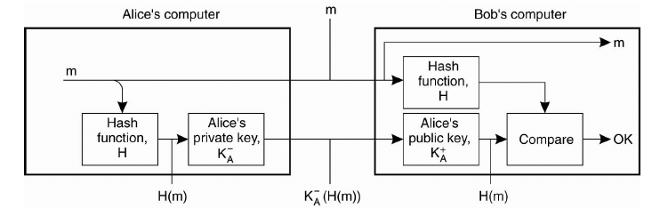

### __Concepts Overview__

**Define confidentiality.**

Confidentiality is the disclosure of information to authorised parties.

Dictionary definition: the state of keeping or being kept secret or private.

---

**Define integrity.**

Integrity is alteration of a system's assets (hardware, software, data etc.) in an authorised way.

Dictionary definition: the state of being whole and undivided.

tldr; essentially we want to protect data from unauthorised/unlawful processing AND against accidental loss, destruction or damage.

The former begin confidentiality, the latter integrity.

---

**Describe the 4 types of security threats**

a) **Interception:** unauthorised party gaining access to a data in transmission. E.g. 3rd person overhearing private conversation between 2 people.
b) **Interruption:** service begin interrupted deliberately by attack. 
c) **Modification:** data is modified by unauthorised party or deliberately to corrupt the data.
d) **Fabrication:** generating additional data that is fake and against specifications.

---

**What are some security mechanisms?**

a) **Encryption:** transforming data into a format that an attacker cannot undersyand
b) **Authentication:** verifying the identity of users s.t. confidentiality is not breached
c) **Authorisation:** verifying whether the user has the permission/privilege to perform an action
d) **Auditing:** monitoring entity access and usage of data, log records

---

### __Encryption__

**Describe the Data Encryption Standard (DES) secret key system.**

DES is a block cipher, that is, an encryption method that involves encrypting a fixed length bit string (e.g. 64 for DES) into ciphertext that is the same length.

DES operates on 64bit blocks of data. It also uses a key to customise the transformation so that only people with the particular key can decrypt the message.

The key has 64bits but only 56 of it is used, as 8 of them are used for checking parity and discarded afterwards.

The key is adjusted every round to create a different key for encryption

Here we can see in the diagram there is an "initial" and "final" permutation.

These actions are inverses of each other and are used for loading blocks. They play no part in the crytopgraphy.

We discuss what happens in each round.

Here $\oplus$ stands for `XOR`. The encryption strategy is clear from the diagram.

We have
$$L_{i} = R_{i-1}$$ 
with
$$L_{i-1}\oplus f(R_{i-1}, K_{i})$$

where $f$ is the hash function, and $K_{i}$ is the 48bit key for round $i$.

Now we discuss how to generate the key for each round.

We break the master 56bit key in half, rotate one left and the other right by 1-2 bits and then extract 24bits from each of the halves. This serves as $K_{i}$.

__Attacks__

It is fairly straightward to break with a brute force attack. 

Sometimes we use DES 3 times(!) with a different master key each time.

---

**What is the notation used for public and private keys?**

$$K_{L}^{+} := \; \text{L's public key}$$

$$K_{A}^{-} := \; \text{L's private key}$$

---

**What are RSA keys and why are they used to create private and public keys?**

The RSA (Rivest-Shamir-Adleman) is one of the first public key cryptosystems used for secure data transmission.

The key behind this method is that finding prime factors of large numbers in polynomial time remains an open problem.

Now, in RSA a user will create a public key to share with everyone and a private key for decrypting messages encrypted by the public key (say another user wants to send a message securely, it will encrypt using the destination user's public key).

The algorithm is as follows:

1) choose $p$, $q$ large prime numbers
These should be random, and large, with different digit length. A primality test can be used to determine prime numbers.
2) Compute $n=pq$.
$n$ is the modulus used for both private and public keys.
3) Compute $\lambda(n)$, where $\lambda$ is the __Carmichael's totient function__. In this case, $\lambda(n) = (p-1)(q-1)$.
4) Pick a number $e$ such that
$$1 < e < \lambda(n)$$
AND $e$ is coprime to $\lambda(n)$.
5) Now compute a number $d$ such that
$$(d\times e)\mod n = 1$$

$e$ := public key
$d$ := private key

The mod $n$ is passed to both private and public keys.

__Carmichael's totient function:__ the Carmichael's totient function $f: \mathbb{Z} \rightarrow \mathbb{Z}$ maps every positive integer $n$ to the smallest positive integer $m$ such that
$$a^{m} \equiv 1 \mod n$$
where $1\leq a\leq n$ co-prime to $n$.

Let's do an example. Let $n = 14 = 2\times 7$. The set of integers coprime to $n$ is
$$A := \{1, 3, 5, 9, 11, 13\}$$
then we have 

$$a^{6}\mod 14 = 1 \;\; \forall a \in A$$

Another way you can think of this is $m$ is the number of coprimes to $n$

__Relatively prime:__ two integers are relatively prime if their GCD is one.
__Co-prime:__ Same as relatively prime

__Encryption and Decryption__

To encrypt a message $M$ we compute chunk the message into $N$ blocks

$$c_{i} = m_{i}^{e}\mod n \;\; \forall 1 \leq i \leq N$$

Likewise, to decrypt a message we have

$$m_{i} = c_{i}^{d}\mod n \;\; \forall 1 \leq i \leq N$$

Note: It takes up to 100-1000x slow to encrypt a message with RSA.

---

**Describe how RSA keys (both private and public) are generated.**

See above.

---

**How much time is required to encrypt messages using RSA relative to DES?**

See above.

---

### __Authentication__

**Define authentication.**

Authentication is a process that confirms the identity of a another party involved in a protocol, and that this party has ACTUALLY participated!

---

**Describe a simple strategy for secret key authentication and explain why it fails.**

In the diagram above, we see that Alice presents a challenge to Bob and he encrypts it with a key and sends his own challenge to the Alice, who then encrypts that challenge and sends it back.

The issue with this is that we can conduct a __reflection attack__ where a malicious user will ask to encode multiple challenges and use those to impersonate him.

**Challenge-response authentication:** one side presents a question ("challenge") that the other side must solve in order to be authenticated. E.g. ask for password and authenticate if correct password is provided.

---

**How would you implement a solution that solves the problem?**

In this solution, we add two steps. The first is that Alice lets Bob know her identity so that he can send her his challenge. Alice replies to Bob with the encrypted challenge and proceeds to send him her challenge.

Bob then replies with the solution to the challenge by applying the secret key.

Here, Bob knows that it's Alice because she can solve his challenge with a secret key. Hence this helps authenticate the identity of the initiator (Alice).

---

**What is a key distribution centre (KDC)? How does it help with authenticating multiple communication channels between nodes?**

In the procedure described previously, it would require $\frac{1}{2}n(n-1)$ different keys for communication amongst $n$ nodes.

Hence we use a KDC that manages this middle-man process. 

Now, in the diagram, we can see that eventually the secret key that both parties have is the same ($K_{A, B}), which is what we are looking for in the first place. 

Hence the KDC can manage the key that both parties use to communicate, meaning that you won't need a unique one for each pair of nodes. The KDC can arbitrarily create pairs and ensure that they are valid for the duration of the communication.

---

**Describe the public key authentication process.**

Here the procedure is similar to the very first approach, but because we are using public keys, we can immediately encrypt using the public key and send the session key $K_{A, B}$ along using each other's public keys. 

The nice thing is that you do not require a centralised KDC.

---

### __HTTPS Protocol__

**Explain how HTTPS protocol over the TLS layer works.**

For HTTPS, we have the usual TCP handshake followed by the TLS handshake.

__TLS handsake__

1) Client: sends client `hello` message to server.
2) Server: Chooses cipher suite to be used in handshake. Sends a server `hello` message back to client. 
3) Server: Sends a certificate, including public key, to client.
4) Client: Checks the certificate against CA. 
5) server: Sends the `hello done` message.
6) Client: Generates "pre-master secret" key based on some of the values of public key.
7) Client: Encrypts the "pre-mater secret" with the public key of the server and sends this key to the server via a `change cipher spec` message. The "change cipher" part refers to the new secret key both sides generate independently using the "pre-master secret"
8) Client: Sends a `client finished` message.
9) Server: Receives the "pre-master secret" and decrypts that with its own private key.
10) Client AND server: Both generate the symmetric key using the "pre-master secret" s.t. they have identical secret keys that can be used to send each other messages.
11) Server: `change cipher spec` message is sent back to acknowledge the construction of the secret key based on the "pre-master secret".
12) Server: Sends a `server finished` message.
13) Data can be exchanged via AES.

Note: The cipher suite offers many different encryption algorithms like AES, RSA, SHA, DHEC.

Below is a diagram summarising the steps

---

**What is a certificate? Why do certificate authorities exist?**

A certificate is a text file containing information that certifies ownership of a public key by the named subject of the certificate.

Certificate authorities (CA) exist to act as a trusted third party and verifies that the certificate is correct you indeed received it from the correct owner.

Some examples of CAs are Comodo, Symantex, DigiCert and Entrust.

---

### __Corroborative Evidence__

**What are some examples of corroborative evidence?**

- **Possession:** physical key, phone 
- **Inherence:** biometrics, fingerprints, iris scan, face, voice
- **Knowledge:** password, security questions etc.

---

**What are some issues with these types of corroborative evidence?**

- **Possession:** device loss or token, SMS messages can be re-routed
- **Inherence:** if compromised, lost forever since biometrics are unchangeable. Most biometric authentication falls back to PIN.
- **Knowledge:** weak passwords, limited possibilities of security questions e.g. first car... systematically test all car models

---

**Explain behaviourial authentication and give examples of what might be possible.**

Behavioural authentication is a new type of authentication designed to identify individuals with high levels of accuracy using patterns in human activity - e.g. keystroke, speech, gait, signature and cognition

It's a passive means of identification that doesn't rely on technical know-how from users. 

One of the most common methods is MFA, multi-factor authentication. 

---

### __Integrity__

**Describe the "public key signature" method. Does this method provide sufficient integrity?**

The goal of integrity is to ascertain that the message received is the same one that we sent.

For the method above, this may not be sufficient because the private can change or be exposed. Either way, you wouldn't know whether the private key is trustworthy or not or whether it's been compromised.

---

**Describe a method to use checksums to determine whether the sent text message is correct.**

Here the difference is that the private key is used to lock the hash message. Now, if the private key changes it doesn't matter because we just apply the public key, the public key is guaranteed to decrypt the hash message.

This time, we rely on the hash function to be the same but the hash used will be a common protocol that everyone knows, so it is fine.

---

### __Privacy__

**Define privacy.**

Privacy is the ability of an individual or group to seclude informations about themselves.

---

**What are some best practices for privacy aware solutions?**

- build privacy and data protection up front
- design into specifications and architecture of information
- design into communication systems and technologies. 

---