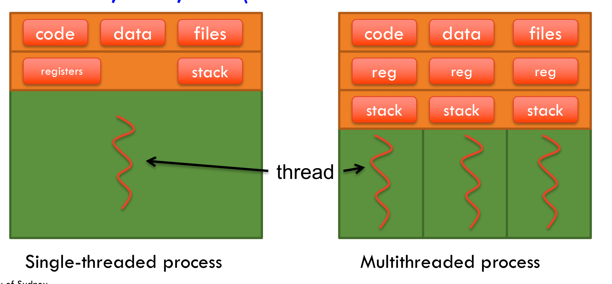

### __Architectures__

**What is the software architecture of distributed systems and what are the two main parts?**

The two main parts of software architecture are

a) __Components:__ modular, replaceable pieces of code with well-defined interfaces
b) __Connectors:__ methods of communication between components that allow for coordination between them.

---

**Briefly describe the 4 types of software architecture. How do they communicate?**

a) __Layer architectures__

It is a "linear" flow where the request gets sent down from layer 1 to n and back up via the same path.

b) __Object-based architectures__

In this model, there are objects in the system and they communicate with each other via RPC (remote procedural calls).

c) __Event-based architectures__

An event is defined as a significant change in state.

An event-based architecture has components connected to an event bus. This event bus has events that can be pulled by the component, and components can publish events to the event bus.

d) __Data-centred architectures__

You have a shared and persistent data storage, and the components connect to it and read/write data.

Basically think of an DMBS.

---

**Briefly describe the client server model.**

A client-server model consists of two parts. Essentially a client requests a service or data, and the server is responsible for executing the service and returning the result or return the piece of data. 

---

**What is the difference between stateless and stateful servers for a client-server model? What are the pros and cons? What about use cases?**

Stateless servers do not remember any details regarding the client. The client would have to authenticate or go through the same process each time to get the data. It also won't remember which files they retrieved and when etc.

In a stateful server, you can request for the server to retrieve the most recently read file since the server will remember.  

---

**What are the 3 application layers?**

The 3 application layers are:

a) **User layer**
b) **Processing layer**
c) **Data layer**

---

**Give an example of a system with 3 application layers. Be sure to clearly label which components belong to which layer.**

For example, the internet. 

a) User layer: The person accessing the URL on their browser.
b) Processing layer: The algorithm that requests the corresponding IP address 
c) Data layer: The server the stores the HTML/CSS + Javascript code required to load the website and its functionality.

Or the search engine:

a) User layer: Google engine interface, the search bar
b) Processing layer: Query generator + PageRank algorithm. 
c) Data layer: Database with webpages. 

---

**What is the difference between single, two and three tiered application layer architectures?**

Three-tiered: User, processing and data on different machines
Two-tiered: User separated from processing and data layer. Also called single server configuration
Single-tiered: Terminal inferface, mainframe configuration.

---

**Give some examples of two-tiered architectures. What about multi-tiered architectures?**

Two-tiered:
- Web brower e.g. Chrome
- Desktop
- Microsoft word

Multi-tiered:
- Cloud computing

---

**Describe the P2P model for decentrialised architectures.**

Every node in the system can act as both a client and server. The control is not centralised. Every node has responsibility over the control.

The peer-to-peer network forms an __overlay network__.

An overlay network is defined as a virtual network that runs ontop an existing physical network. 

The links between the nodes in the network are no longer physical but logical in nature.

The aim of a network overlay is to introduce new services or networks without having to re-configure the entire network.

In overlay networks, the data sent across is encapsulated - that is, packets are put inside another packet that are decapsulated when they arrive at the destination.

In an overlay network, virtual machines can also be moved to different locations without re-configuring the physical network. 

Data routing is also more flexible, as multi-path forwarding is possible.

Multiple layers of encapsulation can lead to alot of overhead and increasing the number of overlay networks can complicate the design. Lastly, the physical network isn't able to automatically adjust to changes so manual re-configuring may sometimes be required.

---

**What about a structured P2P model? Give some examples.**

E.g. routing tables, distributed hash table, content addressable networks

---

**What is a distributed hash table?**

A distributed hash table is a distributed hash table where each node is stored in a different location (server). The nodes are connected by pointers to the next node, and partitioning of data is typically done by using range or some other grouping attribute (preferably with some ordering). 

The nodes also store the pointers to the next couple of tables that are mapped using the lowest value in the destination nodes. This allows for fast iteration through the DHT to retrieve the value based on the key.

**Describe an edge-server system.**

An edge-server system is when multiple servers are placed near the end-user (so at the "edge" of the network). 

Here, the servers are treated as the original. This allows for faster access to the data and thus is useful for streaming services like Netflix.

**What is a collaborative distributed system?**

A collaborative distributed system like BitTorrent, for example, aims to quickly replicate large files to a large number of clients.

Typically this type of system involves multiple nodes collaborating towards a common goal.

In the case of BitTorrent, we have a client requesting for a file and there are multiple nodes where this file is stored. That allows for a parallelisation of the download process, resulting in much faster download times. 

More specifically, the server hosts a `.torrent` file that maintains information about the file and tracker.

The tracker maintains knowledge about all replicas of the file and their locations. That way, when a file is requested the tracker can proceed with parallelisation, as mentioned before.

### __Processes__

**Illustrate using a diagram the execution flow of a process/es when executed on a CPU?**


---

**How does a single CPU give the illusion of concurrency?**

The key idea is concurrency - run a single process and schedule constant swapping of execution of different processes one after another. That is, break up processes into little chunks and execute them in sequence.

---

**What are some examples of concurrency systems?**

- A processor with multiple cores.
- A group of 5 elevators in the same building.
- Road traffic

---

**Define concurrency.**

Concurrency is the tendency for different events to occur at the same time, or simultaneously. In computer science, it refers to the ability of a software/program to execute different processes simultaneously.

---

**Define a process.**

A process is a standalone execution of a program.

The operating system will isolate every process so that they do not collide or interfere with each other. To this affect, a private address space is created for each individual process.

---

**Why does concurrency transparency come at such a high cost for OS?**

There is a high cost because each process has it's own private address space and __context-switching__ is very expensive (switching between processes on the same CPU).

When context-switching occurs, the OS has to do many things e.g. save the CPU context, which consists of register values, program counter, stack pointer etc., modify registers of MMU (memory management unit) and invalidate address translation caches inside the TLB (translation lookaside buffer).

If more processes are running than possible to maintain in main memory, the OS will have to write to disk and that is even more expensive.

---

**What is an "address space"? Sketch the components and describe them.**

The address space is the unit of management for a process's virtual memory.

It consists of the extendable stack, extendible heap (for dynamically allocated variables), global scope data and other items such as text/meta data/program code etc.

---

**Describe the process management step in terms of **
a) **process creation** 

When a process is created, a virtual, private address space is allocated.

b) **Context-switching**

Context-switching between two processes requires kernel intervention.

Specifically, if you have process A and B, the following steps need to occur for another process to begin execution.

First you would switch from 

$$\text{user mode} \rightarrow \text{kernel mode}$$

then you would execute the flushing of TBL, changing of memory map inside MMU etc.

After you complete this, you would now "context-switch" to process B:

$$\text{kernel mode: A} \rightarrow \text{kernel mode: B}$$

and then finally 

$$\text{kernel mode} \rightarrow \text{user mode}$$

c) **Inter process communication**

This involves context-switching of course, but also requires additional components such as message queues, semaphores anmd pipes etc.

---

**What are some key differences between threads and processes?**

Threads are the smallest unit of CPU utilisation. Every process has at least once threat the executes the program code. Inside a process you can have multiple executing in parallel. For multithreads, the code, files and data are shared but the registers and stack are not.

**Sketch the diagram of a single vs. multi-thread sharing resources.**



---

**What is the difference between user-scheduled vs. kernel scheduled threads?**

__User-scheduled threads__

They are easy and cheap to create and destroy. Context-switching is cheap as many things are shared - you only need to reload CPU register values.

However, it is a blocking system call so it freezes all other threads when itself is blocked.

__Kernel-scheduled Threads__

Kernel scheduled threads are expensive to create and destroy. It doesn't block other processes (or itself) when it encounters a blocking system call.

However, context-switching is costly - it is similar to process context-switching. This is because every threwad operation e.g. creation, deletion and synchronisation will have to be carried out by the kernel which requires a system call. 

---

**Briefly describe the LWP.**

LWP stands for lightweight process, which is a hybrid solution of kernel and user-scheduled threads.

The LWP runs in the context of a single process but there can be several LWPs shared by a single process. 

The OS typically also offers a user-level thread package, as well as functionality for synchronisation e.g. mutex and condition variables. Threads from this package are implemented entirely in the user space, and the operations on the threads will be carried out WITHOUT the intervention of the kernel.

Typically, in your kernel space sits the LWPs with the usree space containing many threads that are shared amongst the LWPs. If a thread becomes blocked on one LWP, context-switch to another LWP on a different thread and your program will keep runnning.

So essentially an LWP that encounters a runnable thread willl context-switch to that threat in user-mode.

---

**What is a Java interface?**

A Java interface is an abstraction that groups related methods with empty bodies.

For an interface method to be accessed, it must be implemented by another class with the "implements" keyword. 

```{Java}
interface Animal {
  public void animalSound();
  public void sleep();
}
class Pig implements Animal {
  public void animalSound() {
    System.out.println("The pig says: wee wee");
  }
  public void sleep() {
    System.out.println("Zzz");
  }
}
```

**Why is thread safety very important?**

Thread safety refers to protecting data from being modified simultaneously by multiple threads.

Writes to a variable must be synchronised.

---

**How do we ensure thread safety?**

- Don't share the variables across threads i.e. thread specific
- Make the state variable immutable
- Use synchronisation to access the state variable

---

**How do we "implement" thread specific data?**

```{Java}
ThreadLocal<Integer> threadLocalValue = new ThreadLocal<>();

threadLocalValue.set(1);
Integer result = threadLocalValue.get();

threadLocal.remove();
```

```
public class ThreadLocalWithUserContext implements Runnable {
  
    private static ThreadLocal<Context> userContext = new ThreadLocal<>();
    private Integer userId;
    private UserRepository userRepository = new UserRepository();
 
    @Override
    public void run() {
        String userName = userRepository.getUserNameForUserId(userId);
        userContext.set(new Context(userName));
        System.out.println("thread context for given userId: "
          + userId + " is: " + userContext.get());
    }
}

----------------------------------------------------------------------------------

ThreadLocalWithUserContext firstUser = new ThreadLocalWithUserContext(1);
ThreadLocalWithUserContext secondUser = new ThreadLocalWithUserContext(2);
new Thread(firstUser).start();
new Thread(secondUser).start();
```

---

**Describe how produce/consumer threads work?**

The producer/consumer threads are used in messaging streaming services like Kafka.

Essentially the producer receives messages and places them in an intermediate storage structure e.g. queues.

Then the consumer thread processes the data one by one without consideration for how much load the producer is under. That is, we de-couple the product and consumption of data that arrives. So the threads can operate "independently" of each other.

---

**Describe the "dispatcher-worker" model for multi-threaded servers.**

The dispatcher-worker model has a specific thread whose job is to allocate tasks to the worker threads that are ideal. In multithreading, there will be multiple workers and typically one dispatcher thread.

---

**What is the difference between a blocking & non-blocking system call?**

A blocking system call will halt the program if it needs to wait for a reply from a client/server or anybody that it requires information from. That is, the caller will wait until it receives a response from the system it called.

A non-blocking system call will simply continue if the information doesn't arrive or doesn't arrive within a specific time frame, and either exit or trigger an exception or something else. It return immediately and the result is either sent through to the caller later oor polled by the caller later. 

**When do we want to use a thread pool?**

Thread pools are useful for avoiding the overhead of creating and destroying threads. 

Using a thread pool, you can also limit the number of threads that are being used in your process, thereby allowing a better allocation of resources.