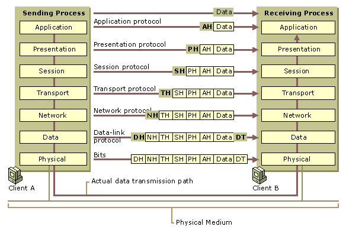
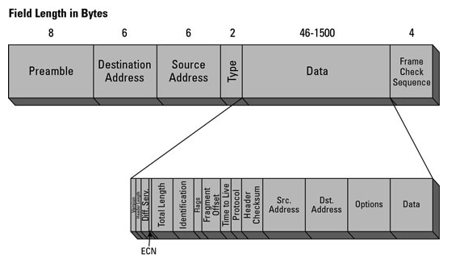
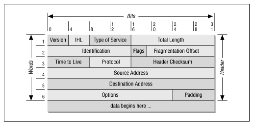
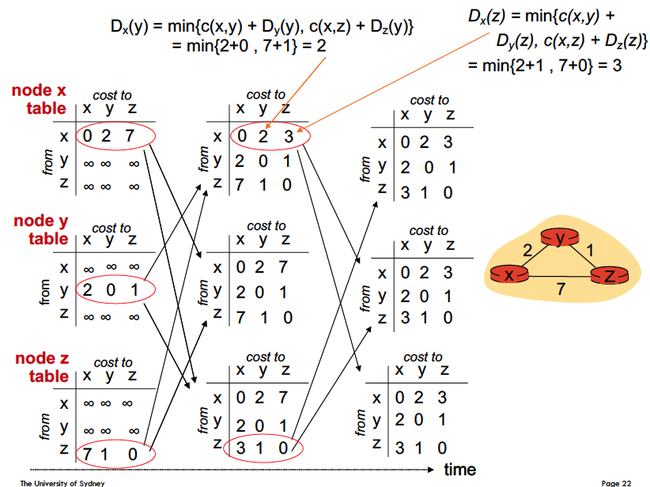
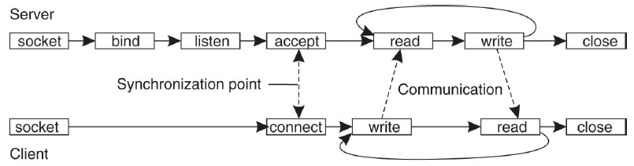
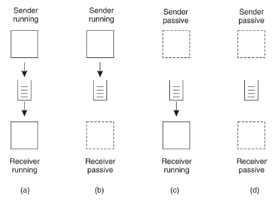
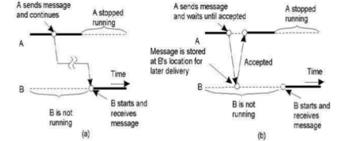
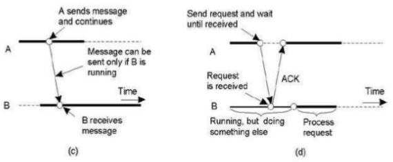

### __Layered Protocols__

**What is the difference between connection-oriented vs. connectionless?**

Connection-oriented requires establishing an explicit connection with another party before sending and receiving data.

Connectionless does not require such a setup. 

---

**What are the 7 layers for OSI layers?**

From top to bottom we have:

A fairly simplified overview of the what is being sent across the network.

At a very basic level, every layer attaches its own header which is then read by the corresponding layer on the receiving end.

Furthermore, we require a __data link layer trailer (DT)__ because physical transmission of the data via optic fibres for example, does not always guarantee an exact sequence of 0 and 1s. 

There are a few issues liek timing (scanning of voltage on a TTL line), shifting, bit damage etc. There may also be periods of no data transfer. All these issues mean that it can be difficult to know when the start and end of some packet is. 

So in the DH and DT we typically include easily-recognised bit patterns and a large number of zeros or ones followed by a toggle seq. e.g. 010101 and only then followed by the data. 

---

**For each layer, describe its function.**

__Application__

Application layer specifies the communication protocols and interface methods that are used e.g. HTTP/S, SMTP, Telnet, FTP etc.

It provides full end-user access to the network. 

__Presentation__

Presentation layer translates text to binary code. It is also responsible for compression (lossy and loseless) as well as encryption e.g. SSL.

__Session__

The session layer manages opening and closing of communication passages between 2 end user application processes, i.e. semi-permanent dialogue

It also manages authentication and authorisation of users as well as synchronisation and data checkpointing and recovery. 

It is commonly used in application environments that make use of remote procedure calls.

__Transport__

The transport layer handles the splitting of messages into frames and prescribes their order (so they can be re-ordered upon arriving at the destination) and port. 

Connection-oriented and connectionless protocols are handled by this layer as well as other aspects of communication protocols like flow control, reliability (checksums + ACK) and multiplexing.

__Network__

The network layer is responsible for packet forwarding, including routing through intermediate routers.

Handles logical addressing e.g. IPv4/6 by assigning sender and received IP addresses. 

__Datalink__

Controls how the data is moved through the physical layer to the computer. It focused on the local delivery of frames between nodes on the same network. Inter-network routing deal are dealt with by higher-layer functions (e.g. network).

This allows the datalink layer to focus on local delivery, addressing and media arbitration.

The layer groups bits into frames and provides error detection and correction.

It utilises what is called "carrier-sense multiple access" (CSMA), a MAC protocol, to detect absence of other traffic before sending dat to avoid collusion of messages between servers that are sending messages on the same media.

It contains a logical link control sublayer provides flow control, acknowledgement and error notification. The MAC sublayer determines who is allowed to access the media at any given time (CSMA).

__Physical__

The physical layer defines the means of transmitting raw bits over a physical data link between connected network nodes. 

The transmission medium could be electrical or radio etc. 

**Piece together how the frame looks at each layer.**

---

**How is the internet stack different/similar to the standard OSI layers?**

The internet protocol stack combines application with presentation and session layer.

---

### __Routing__

**What is the routing problem?**

The routing problem is finding a least-cost path between two nodes in a graph. Although we could technically abstract the data structure away and say that we are looking for a least-cost path between two locations. 

For networking, routing is applicable in all cases except in a network where every node is connected directly to every other node.

---

**How do you classify routing algoritms?**

Routing algorithms will differ based on a few things.

$$ \text{global or decentralised information?} $$

That is, do all routers know the complete topology along with the link cost information?

If we have global information we use "link state" algorithms.

If the network is decentralised, then a router only knows the link costs to its physically connected neighbours.

Then we use "distance vector" algorithms.

$$ \text{static or dynamic?} $$

This concerns how often the connections (links) between nodes change. If it changes often then dynamic else static.

---

**What is the distance-vector algorithm?**

The distance-vector (DV) algoritm is an algorithm that determines the best route for data packets based on distance.

Define $d_{x}(y)$ as the optimal distance from node $x$ to $y$. Then the optimisation of the distance-vector algorithm as

$$d_{x}(y) = \underset{v}{\min}\big\{c(x, v) + d_{v}(y)\big\}$$

where $c(u, v)$ is the cost of travelling from $u$ to its neighbour $v$, and $d_{v})y)$ is the optimal cost from $v$ to $y$ (not necessarily neighbours).

The distance-vector algorithm has 3 properties:

1) __Distributed:__ nodes only notifies its neighbours when it receives an update that changes the table of distance values.
2) __Iterated:__ process updates will continue until no more information is available for exchange between neighbours. Periodic updates are issued.
3) __Asynchronous:__ Nodes do not need to be in lock step with each other.

If a node detects a change or receives an update from its neighbour, it will recompute the table of values and if it differs, broadcasts the changes to its own neighbours.

Each node stores information on the table of values for all routers as propagated to them by their neighbours, and do not see the network topology (this is a decentralised algorithm after all).

Note that here we use an integer value for the cost of travelling between nodes. The RIP algorithm (as you will see below) determines distance based on number of hops i.e. how many routers it has to pass.

---

**What is the "count to infinity" problem?**

When updates are propagated throughout the network, if the update results in a faster travel time then the propagation happens very quickly.

Conversely, if the update results in a slow travel time between nodes then the propagation requires many iterations before it converges (settles down).

Sometimes, the propagation will lead to an infinite loop and not converge!

Consider the following example below.

||A|B|C|D|
|:---:|:---:|:---:|:---:|:---:|
|A|0, -|1, A|2, B|3, C|
|B|1, B|0, -|1, C|2, C|
|C|2, B|1, C|0, -|1, C|
|D|3, B|2, C|1, D|0, -|

That is, we have

$$A \Longleftrightarrow B \Longleftrightarrow C \Longleftrightarrow D $$

Then suppose the connection is cut-off between A and B. 

$$A \nLeftrightarrow B \Longleftrightarrow C \Longleftrightarrow D $$

Then the correct update would be everyone mapping destination to A as distance $\infty$ since it is not reachable.

However, let's consider what happens when we try to propagate it.

1) $B$ will be the first one to notice since it's an immediate neighbour. Then it simply updates its own table correctly to be

||A|B|C|D|
|:---:|:---:|:---:|:---:|:---:|
|B|$\infty$, -|0, -|1, C|2, C|

2) Suppose then $B$ receives from $C$. It sees that $C$ has a path of cost $2$ to $A$ because $C$ has not yet received the message from $B$ that an outage has happened. Because of this, $B$ updates its table again.

||A|B|C|D|
|:---:|:---:|:---:|:---:|:---:|
|B|3, C|0, -|1, C|2, C|

3) Now $C$ sees that $B$ has updated its cost to $3$, and thus it needs to also update its cost table.

||A|B|C|D|
|:---:|:---:|:---:|:---:|:---:|
|C|4, B|0, -|1, C|2, C|

4) And now the loop starts... $B$ sees that $C$ has updated again and hence updates its table...

||A|B|C|D|
|:---:|:---:|:---:|:---:|:---:|
|B|5, C|0, -|1, C|2, C|

...

and the cycle continues.

Even if we're not counting to infinity, the number of iterations is large. Let's look at another example.

||X|Y|Z|
|:---:|:---:|:---:|:---:|
|X|0, -|4, X|5, Y|
|Y|4, Y|0, -|1, Y|
|Z|5, Y|1, Z|0, -|

$$X \overset{4}{\Longleftrightarrow} Y \overset{1}{\Longleftrightarrow} Z \overset{50}{\Longleftrightarrow} X $$

Suppose now we update this to 

$$X \overset{60}{\Longleftrightarrow} Y \overset{1}{\Longleftrightarrow} Z \overset{50}{\Longleftrightarrow} X $$

a) $Y$ recognises the increase in cost so it updates its own table

__Another example__

There are a couple of ways we prevent and mitigate this problem.

||X|Y|Z|
|:---:|:---:|:---:|:---:|:---:|
|Y|6, Y|0, -|1, Y|

Using $c(y, z) + d_{z}(x) = 1 + 5 = 6$. So now we've managed to update $Y$ to route through $Z$ because $Z$ has not yet been updated. 

b) Similarly, $Z$ has not yet been updated but it sees that it's route through $Y$ has been updated to a higher cost. So it updates as follows:

||X|Y|Z|
|:---:|:---:|:---:|:---:|:---:|
|Z|7, Y|1, Z|0, -|

c) and the propagation continues until we stabilise, 44 iterations (need to hit 51 to obtain the new minimum routing $Z$ directly to $X$.

__Solving the problem__

1) __Route Poisoning__

When a route fails, we can spread the news by propagating a new distance of $\infty$, which the nodes will consider as a route failure.

2) __Horizontal split__

To prevent the loop from occurring, we have that when $X$ receives from $Y$, $X$ will send its updated info immediately back to $Y$. The horizontal split rule prohibits this action.

Typically this is combined with route poisoning as if we propagate infinity then the node considers the failure and doesn't propagate its stale values back to misguide its neighbour.

3) __Hold-down timers__

If a connection goes down, set a time period where any exclusive connections to that node are NOT updated.

---

**What is the route information protocol?**

The route information protocol (RIP) is one of the oldest routing protocols that employ distance-vector algorithm.

It treats the cost between routers as 1, and maintains a small number of maximum hops allowed (15). Furthermore, node failures are set as $\infty$ and it applies the 3 concepts mentioned in the previous answer to prevent incorrect propagation.

It utilities user datagram protocol (UDP) as its transport protocol.

Lastly, the nodes broadcast updates every 30 seconds. 

---

**Describe Djikstra's algorithm.**

Recall that for globally-aware networks, we can use "link-state" algorithms. Hence we can use Djikstra's algorithm, which is used to find the shortest path from a node $i$ to other nodes.

The complexity is $O((\lvert E \rvert + \lvert V\rvert)\times \log \lvert V\rvert)$

---

**Describe the link-state algorithm.**

Link-state algorithm requires formation of neighbours.Neighbours can be formed if the nodes run the same protocol.

Once the neighbours are formed, a node can then advertise information about itself to its neighbours.

The information is called __link-state advertisement (LSA)__, which contains information about router information, connected links and state of the links. 

Every node in the network is going to receive a LSA from every other node in the network. This means that every node will have the same network information. The idea of dissemination LSAs throughout the network is known as __flooding__. 

When a node receives a LSA it stores it in a __link-state (topology) database (LSDB)__. Once the information has been acquired, the node will run an algorithm (e.g. Djikstra's) in order to compute the fastest route between itself and all the other nodes.

So how do nodes become neighbours?

It sends out a "hello" message and any nodes running the same protocol can respond. They compare each other's OPSF configurations (see next question) and determine whether they will become neighbours.

Nodes do not share LSAs with other nodes that are not neighbours. 

The LSAs will be sent out periodically (default 30mins). The LSAs are partial updates and not everything. It staggers so that it doesn't send a large volume of traffic at once.

The cost of a route is determined by the bandwidth. LSDB holds information about the nodes in the network and not the actual computed shortest path. It only computes the shortest path after receiving information from everyone.

---

**Describe the OPSF (open-shortest-path-first) protocol.**

There are versions 2 and 3, 3 being more recent. It has low bandwidth requirements.

It supports CIDR, VLSM and authentication. The metric is cost of link bandwidth.

There is a hierarchical design model using "areas".

The routers (nodes) play different roles in OPSF.

The basic ideas are reflected in the answer to previous question.

Let's start with dynamically discovering neighbours in the protocol.

The "hello" packet has some information 

- OSPF Router ID
- Area ID (segmenting network)
- Router priority
- Hello & dead interval
- DR & BDR
- OSPF neighbours

The "hello" information need to match in order for two nodes to become neighbours. Specifically, the

- subnet number
- subet mask
- hello interval: wait period before sending out hello message
- dead intervals: wait period before declaring a neighbour is down
- area ID
- authentication
- stub area flags

Now let's start a simulation. Suppose you have nodes $A$, $B$ and $C$.

$A$ sends hello packet to $B$. If $B$ makes a successful comparison, then it sends a hello packet back to $A$ and includes $A$'s OPSF ID. This tells $A$ that $B$ has received its hello packet.

The dedicated IP address for hello packets is 224.0.0.5 

Now it can communicate with each other.

As the system runs, the states between two neighbours might change. If a connection breaks then it will be in a down state.

The next step is the INIT state, neighbours are starting to talk to each other by sending out hello messages. This is for $B$ replying to $A$ with $A$'s OPSF ID.

The last step is the TWO-WAY state, when $A$ replies to $B$ with $B$'s OPSF ID. This is the TWO-WAY state. We have established a bi-directional communication.

From there, we have 2 possibilities.

1) Exchange topology information --> then the 2 nodes become __full neighbours or fully adjacent__.
2) Elect a 3rd node to which all neighbours will become fully adjacent.

So essentially 2) is used to elect a leader to coordinate the communication between neighbours in a large network.

There are two network types in OPSF.

a) broadcast
b) point-to-point

For b), the nodes will continue an exchange of information until they become fully adjacent. 

For a), the default behaviour is different, and two nodes do not become fully adjacent. They will elect a focal point s.t. each router only becomes adjacent with the focal point router. That router is the __designated router (DR)__.

The routers that adjacent to the DR remains in the TWO-WAY state.

There is also a __backup designated router (BDR)__, that is just backup to the DR.

The election of a DR is based on a priority - a value based on 1-255. If the value is tied, then you compare the router ID. The 2nd highest usually becomes the BDR.

Set priority to zero for a node if you don't want it to become DR.

So let's go back to b) case. In order for two nodes to real fullly adjacent (full neighbour) status, the following needs to happen.

One of the nodes need to initial the process by becoming the leader. This is called the Exchange-start state.

Then the nodes enter the exchange state. Each node will send the database description fo each other. They inspect each other's description and request LSA from their partner for the routers it doesn't already know about.

This continues until they have the exact same information, and when this happens they reach the fully adjacent state.

---

**Describe the IS-IS protocol.**

The lecture slides state that they are very similar. However, there are indeed alot of details that define how different this protocol is.

If you are interested, you can do a quick Google but the details are much beyond the scope of this lecture series.

Check out this resource [here](https://protechgurus.com/ospf-and-isis-differences/).

---

### __Sockets and Different Types of Communication__

**Define sockets. How are they identified?**

> A communication end-point to which an application can write data that is to be sent out over the underlying network, and from which incoming data can be read.

Sockets are used by two separate processes to communicate over a network, one socket for each process.

Sockets are identified by an IP address concatenated with a port number.

In general they use the client-server model.

---

**What are the 3 socket classes?**

1) __DatagramSocket:__ (UDP) connectionless socket that favours throughput rather than reliability
2) __MulticastSocket:__ a subclass of DatagramSocket that sends data to multiple recipients
3) __Socket:__ Connection-oriented (TCP) socket to open a communication for reliable communication.

---

**What are MPIs**

MPI = message passing interface. 

It is a standardised and portable message-passing interface designed to function on parallel computing architectures. It defines syntax and semantics of a core of library routines that are relevant to users writing portable message-passing programs in C, C++ and Fortran.

You can have both sync and async sends and you can pass pointers as parameters. You also have blocking and non-blocking checks. 

What are **MOMs**? How do they work?

MOM = message-oriented middleware.

Software and hardware infrastructure supporting send and receive of messages between distributed systems. 

The middleware layer allows software components that have been developed independently and run on different networking platforms to interact with one another. The components will use the application interface of MOM to communicate. It also supports asynchronous calls between the client and server applications.

In principle, each application maintains a local queue that receives incoming messages. The application will process the messages in its own time. Hence non-blocking.

---

**Define and describe and the following types of communication.**
a) **Persistent**

Message transmitted is stored by the middleware until it is delivered/processed by the received e.g. email, SMS

b) **Transient**

Message is stored as long as sender and received are both running, the receiver needs to be running when the message is received.

c) **Synchronous**

Blocking. The sender is blocked until the message is stored in local buffer at host or the message is actually delivered. Alternatively, the strongest form of synchronous communication is when the sender blocks until the receiver has finished processing the message. 

d) **Asynchronous**

Non-blocking. Sender does not wait for reply from receiver and continues to execute its program.

a) persistent asynchronous
b) persistent synchronous

c) transient asynchronous
d) transient synchronous (receipt-based)

---