### __Message Loss__

**What does message loss occur?**

Message loss occurs because networks are unreliable and messages can be distorted, sent to wrong place, or node with message in it suddenly fails. 

It can also occur if a server receives too many requests simultaneously so it cannot process it all or the router drops the message because its queue is full.

---

**What is TCP?**

Transmission control protocol (TCP) is one of the main protocols of the Internet protocol suit. It belongs to the transport layer of the TCP/IP suite. SSL/TLS often runs on top of TCP.

It is connection-oriented, reliable and sends data via an in-order byte stream. The protocol is flow-controlled and congestion-controlled.

---

**What does TCP actually put inside its segment?**

The segment consists of source and destination ports, sequence number, acknowledgement number, a checksum, `rwnd` (receiver window, that informs sender how much data the destination side can receive) and urg pointer (urgent) which tells the received to process the urgent packets first.

There are 6 flags in TCP:

1) **Urgent pointer** (do not wait until previous segments have been consumed but are sent directly and processed immediately)
2) **ACKnowledgement**
3) **PUSH** (gives priority but typically used at start and end of a data transfer. Adding this to the last segment of a file also helps prevent deadlocks.  
4) **Reset (RST) flag** used when a segment that has arrived is not intended for the current connection. I.e. if you were to send a packet to a host in order to establish a connection and there was no such service waiting to answer, then the host would reject your request and send you a RST flag to indicate that the remote host has reset the connection.
5) **SYNchronisation flag** used to establish a 3-way handshake between two hosts. 
6) **FIN flag** used to tear down virtual connections created by SYN flag. 

Note: the receiver is responsible for handling out-of-order segments.

Now, the following example should illustrate what happens during a 3-way handshake (that we will discuss in a later question)

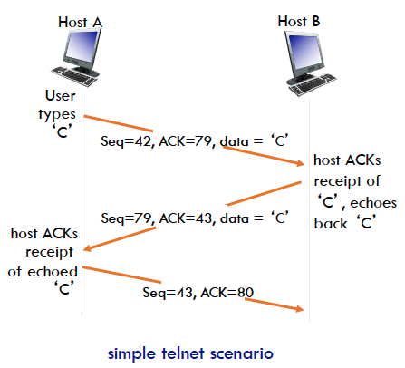

---

**How is the timeout value used in TCP events?**

We use a `Timeout Interval` because the data/message may have been lost during transmission from either the sender or receiver end. 

Hence we want to resend that lost message. Now, the network traffic is dynamic and latency might be high or low depending on congestion levels so we want out timeout value to be dynamic too.

We calculate a `Timeout Interval` based on round-trip-time (RTT). Since we can't be sure of the exact RTT, we calculate a `SampleRTT` using the time frame between segment transmission until ACK receipt.

Periodically we estimate the RTT, denoted `EstimateRTT`

$$\text{EstimateRTT} = (1 - \alpha)\times\text{EstimatedRTT} + \alpha \times \text{SampleRTT}$$

A typical value for $\alpha$, the weight of the previous estimate, is $\alpha = 0.125$.

Using this, we calculate the `DevRTT`, the deviation of the `SampleRTT` and incorporate it as a safety margin for determining the `Timeout Interval`.

$$\text{DevRTT} = (1 - \beta)\times\text{DevRTT} + \beta \big\lvert \text{SampleRTT} - \text{EstimatedRTT} \big\rvert$$

A typical value for $\beta$, the weight of the previous estimate, is $\beta = 0.25$.

Finally we can calculate the `Timeout Interval` with

$$\text{Timeout Interval} = \text{EstimatedRTT} + 4\times\text{DevRTT}$$

---

**Illustrate some re-transmission scenarios**

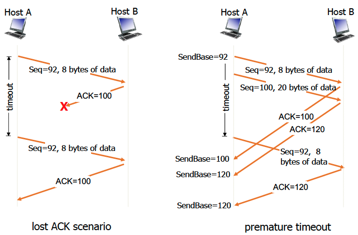

---

**How does "fast re-transmit" work?**

Fast re-transmit is an enhancement to TCP that reduces wait time for the `Timeout Interval` in the case that one of the segments of data is lost and the `ACK` doesn't reach the sender. 

This allows for faster retransmission by detecting duplicates ACK numbers.

First we note that the ACK can only acknowledge the last in-order byte of data that is received.

Hence for an in-order packet this is effectively the last packet's sequence number plus its payload length.

If the 2nd packet is lost but the 3rd is received, the received can only acknowledge the last in-order byte of data, which is the same as the one for the first packet.

Hence if this occurs 3 times in a row, we can be reasonably sure that the second packet was lost in transmission.

Hence the sender will retransmit that packet immediately without waiting for its timeout.

The reason why we wait for 3 duplicates is because sometimes a duplicate is sent because the sender is just doing a re-ordering of the segments. In this case only 1 or 2 duplicates are expected.

3 or more duplicates indicates a high probability of a lost packet.

---

**Describe TCP flow control.**

In flow control, the receiver controls the amount of traffic the sender is throughputting into the buffer. 

This is done so that the speed at which data is being transmitted does not overflow the buffer and cause loss of messages. 

This is very important for machines that communicate with different network speeds e.g. mobile phones vs. computer. 

TCP uses a sliding window flow control protocol. Each TCP segment has a received that specifies in the "receive window" field that amount of additionally received data (in bytes) that it is willing to buffer for the connection.

The sender must wait for an acknowledgement and window update before it can send more than that. The sender uses a "persist timer" to avoid a deadlock in case the message from either party was lost in transmission.

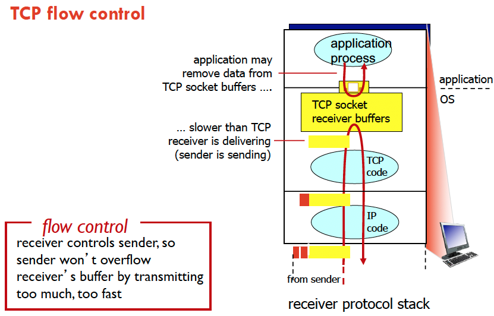

The receiver will use the `rwnd` in the TCP header to inform the sender of its free buffer space. `rcvBuffer` size is set via the socket options (default it is 4Kb).

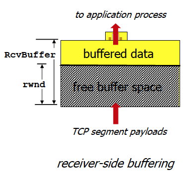

---

**Describe TCP congestion control.**

TCP aims to avoid congestion collapse (congestion that limits or prevents useful communication between nodes in a network), which generally occur at around choke points in the network, where incoming traffic exceeds outgoing bandwidth.

Congestion control has mechanisms that control the rate of data entering the network so all nodes play a part in keeping data flow below a rate that would trigger a congestion collapse.

First let's define __maximum segment size (MSS)__, which is the largest amount of data, in bytes, that TCP is willing to receive in a single segment.

The approach that TCP takes is by having the sender increase transmission rate (window size) and probing for usable bandwidth until a message loss occurs.

We have

a) __additive increase:__ increase `cwnd` by 1 MSS every RTT until loss is detected
b) __multiplicative decrease:__ cut `cwnd` by half after loss. 

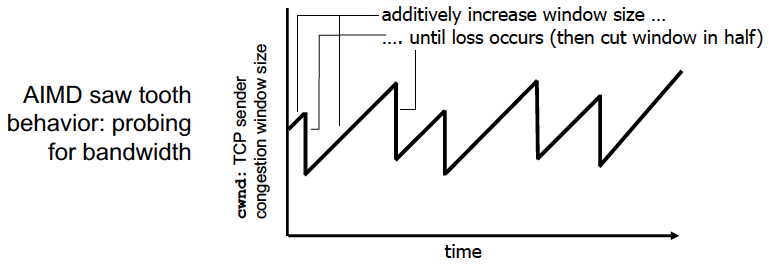

The sender has to limit its transmission by the `cwnd` (congestion window). That is

$$\text{LastByteSent} - \text{LastByteAcked} \leq \text{cwnd}$$

Since the congestion window is dynamic, so is the TCP sending rate;

$$\text{rate} \sim \frac{\text{cwnd}}{\text{RTT}}\text{bytes/sec}$$

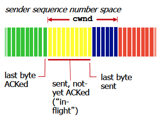

So how does it all work?

__Slow start__

Start with `cwnd` = 1 MSS, then double every time until first message loss occurs.

__Reacting to Loss__

If it is a timeout, then set `cwnd` = 1. Then window grows exponentially to threshold and then switches to linear growth.

If it is 3 duplicate ACKs, then `cwnd` is cut in half and grows linearly

The TCP Tahoe protocol always sets `cwnd` = 1 after a loss.

__Jumping to linear growth__

The exponential growth of MSS should switch to linear growth of MSS when `cwnd` gets to half of its value before timeout.

---

**What is the difference between flow and congestion control?**

Flow control deals with how much data the node itself is receiving whereas congestion control deal with controlling the capacity of the network itself.

---

**What has to happen before 2 access points on send each other data with TCP?**

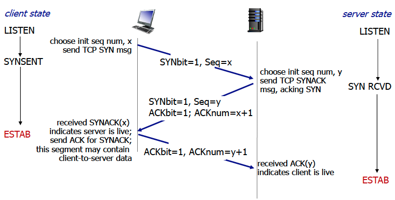

---

**How do you close the connection?**

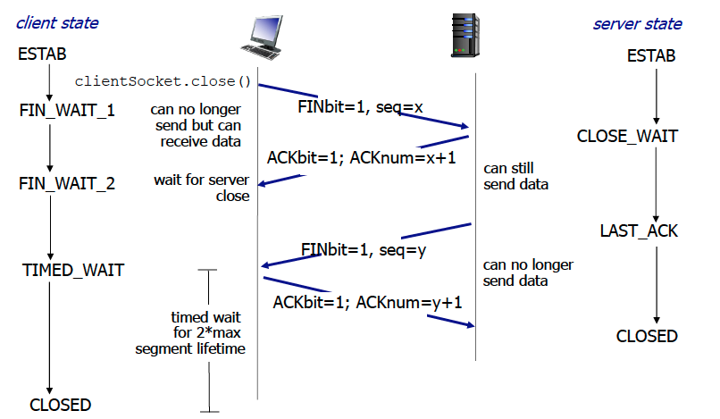

---

**Explain HTTP at a high level.**

- Uses TCP, port 80 and server accepts TCP from client. HTTP messages exchanged between browser and web server
- stateless
- HTTPS = HTTP + SSL/TLS

---

### __Remote Procedure Call (RPC)__

**Draw the timeline diagrams for synchronous and asynchronous calls.**

__Synchronous__ 
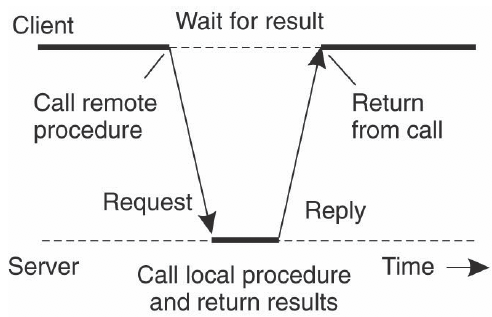

__Asynchronous__
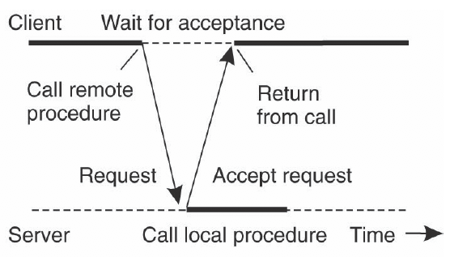

__2 Asynchronous RPCs__

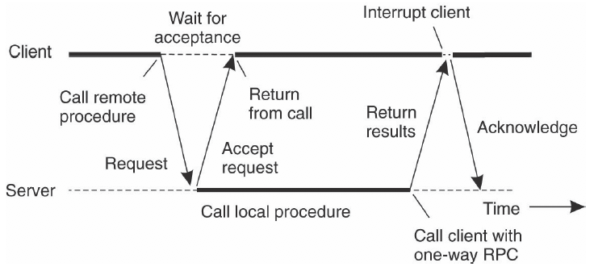

---

**Describe the sequence of steps for a RPC.**

1) Client calls RPC i.e. client __STUB__ (piece of code that is used to stand in for someone else's code/functionality)
2) STUB puts params and sends message to system (OS)
3) Client OS sends to server OS
4) Server OF sends info to server STUB
5) Params are removed from STUB
6) STUB calls the server procedure

---

**Describe the "distributed computing environment"?**

The DCE supplies a framework and toolkit for developing client/server applications. These components include:

- RPC mechanism known as DCE/RPC
- Directory service
- Time service
- Authentication service
- Distributed file system

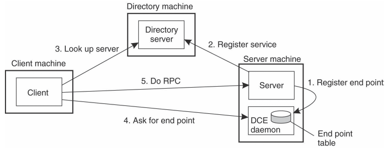

---

### __Multicast Communication__

**What is an overlay network?**

An overlay network is defined as a virtual network that runs ontop an existing physical network. 

The links between the nodes in the network are no longer physical but logical in nature.

The aim of a network overlay is to introduce new services or networks without having to re-configure the entire network.

In overlay networks, the data sent across is encapsulated - that is, packets are put inside another packet that are decapsulated when they arrive at the destination.

In an overlay network, virtual machines can also be moved to different locations without re-configuring the physical network. 

Data routing is also more flexible, as multi-path forwarding is possible.

Multiple layers of encapsulation can lead to alot of overhead and increasing the number of overlay networks can complicate the design. Lastly, the physical network isn't able to automatically adjust to changes so manual re-configuring may sometimes be required.

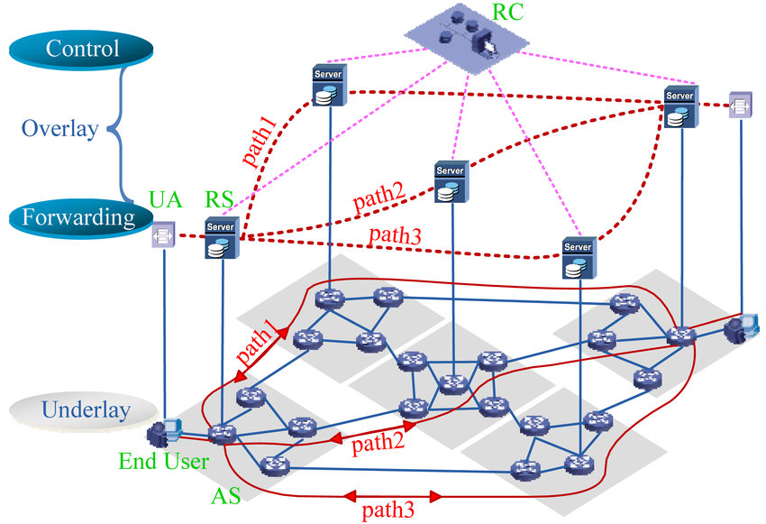

---

**How do we measure quality of application-level multicast tree.**

Setting up communication paths for information dissemination is a huge effort and ISPs are not too keen to support multicasting.

For application-level multicasting the nodes are organised into an overlay networks, e.g. tree or mesh network.

To measure the quality, we use 3 metrics

1) __Link stress:__ how often a packet crosses the same link
2) __Relative delay penalty:__ Ratio in the delay between two nodes in the overlay vs. delay those two nodes would experience in the underlying network
3) __Tree cost:__ Aggregated link costs of the tree. 

---

**How does gossip based data dissemination work?**

In gossip-based data dissemination, we have 3 types of nodes:

1) __Susceptible:__ node that has not yet seen the data
2) __Infected:__ node that holds the data and want to spread to other nodes
3) __Removed:__ updated node that does not want to spread its data

A simple algorithm works as follows:

- A node $P$ picks another node $Q$ at random
- $P$ pushes new message to $Q$
  - If $Q$ is updated, reduce $P$'s probability of disseminating update by $\frac{1}{k}.
  
This algorithm does not guarantee delivery to all nodes. 

We can use __anti-entropy__ (periodically exchange information with random partners and try to reconcile potentially inconsistent copies of the replicated data) and __network topology aware dissemination__ (directional gossiping).

---