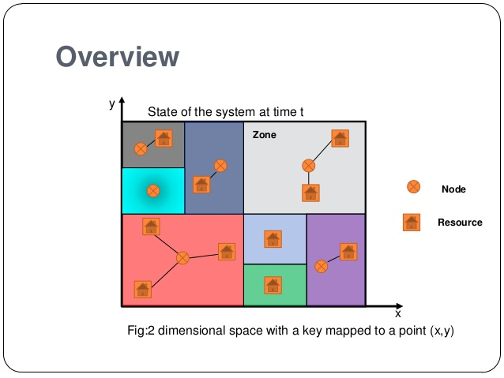

### __Naming__ 

**Define "name" in the context of distributed systems.**

A "name" in the context of distributed computing is an identifier for a resource in a distributed system.

We can also refer to resources as entities, e.g. computers, files, users, remote objects etc.

---

**What is the difference between an address an identifier?**

An address is an access point of an entity. This access point could be a single resource or one particular port of a resource. 

An identifier uniquely identifies an entity/resource.

---

**What are some characteristics of access points?**

Access points are often human unfriendly and inflexible. The underlying entity that the AP points to may change over time. AP can also be configured to point to a different resource. We can have multiple APs pointing to a single resource.

---

**What is a physical address?**

The physical address is the actual address of the hardware itself that the datalink uses to deliver data (frames) to locally. In a computer, the physical address is referred to as the MAC address.

The MAC address is a collection of 48 bits, setup by the manufacturer, that represents a unique number.

A single computer can have multiple inferfaces and physical addresses.

In short, a physical address is a unique identifier to a network interface.

---

**What is a address resolution protocol?**

An address resolution protocol is a communication protocol used for finding the link layer address (physical layer address e.g. MAC address) that is associated with an internet layer address e.g. IPv4 address. 

This mapping is a critical function in the Internet protocol suite.

---

**How do we locate an entity in a network? Explain broadcast vs. multicast**

We can either 

a) __broadcast:__ essentially one node spends a message to all nodes and tells them its own identifier. Machines with AP to that identifier reply.
b) __multicast:__ nodes are grouped and we broadcast to a single node in a group. This node is responsible for forwarding the message to all the other nodes. 

---

**How do we locate entities that are mobile? Discuss the "forwarding pointers" and "home-based approaches".**

Suppose we have an entity that switches locations often in the network. If a client requests an AP to this entity if it has moved then the previous AP would be pointing to a different entity.

Hence we need a way of tracking and storing the new AP for the entity. We can use

a) __forwarding pointers:__ Each time an entity changes location, it leaves behind a pointer in its current location. 

That way you can find the entity by following a series of pointers. However, what if one of the pointers are deleted or removed? This potentially poses an issue. Moreover, if there is a long trail, then it is costly in both space and time.

b) __home-based approach:__ We have the entity report it's AP to a central location periodically. Hence if it moves we always keep a single point of reference.

Problems can occur if the storage has downtime or if the data is corrupted. Communication delays may be experience if the entity moves very far away from the node.

Alternatives to this may be using name servers and name resolution server. A single server maintains a directory of names and informs the client of the address whenever the server is requested.

---

### __Unstructured Naming__

**What is a DHT and how does it work?**

A distributed hash table (DHT) is a hash table data structure that is stored across different nodes. It is like an overlay network, with each node pointing to a subset of the nodes.

For example, assume you utilise a hash function and take the modulus. You want to use a hash function that partitions the numbers as evenly as possible.

A DHT is also fault-tolerant and only small changes are required for churn (deletion). It is scalable of course and the routes are typically short, $O(M)$ lookup for $2^{M}$ nodes.

When distributing data on nodes, it may not consider network-proximity. It also only knows its neighbours (e.g. CAN DHT).

---

**What is distributed lookup and the difference between "iterative" and "recursive" lookup?**

a) __Iterative:__ The lookup function returns the address of the node that the pointer points to so we can call lookup on the node.
b) __Recursive:__ The request of the root node is passed to the next node that it finds. That is, the execution of the function is done at the next node rather than the root node. 

---
- Describe the chord DHT.

Each node in the chord has a randomly chosen id $k$. Each file that is stored has a key that is determined by the hash function. The key is encoded in $m$ bits, usually 128 or 160 depending on the has function used.

Let $p$ denote a node. Define $succ(k)$ as the node that stores the value $k$, the successor of $k$. The succesor is determined by

$$\min\{\text{node.id} \geq k\}$$

Each node keeps track of a finger table $FT$, where 

$$FP_{p}(i) = \text{succ}(p+2^{i-1})$$

where $p$ is the current node and $i$ is the $i^{th}$ row in the finger table. 

__Insertion (of value)__

Start at root note. Use Finger table for lookup.

If value is between current node and direct successor, insert into successor node.

Otherwise, go to the largest node that is smaller than the value.

__Deletion (of value)__

Find it and delete... as usual.

__Insertion (of node)__

Lookup for the successor of the (value+1) that is bigger than the value of the node you want to insert. Update predecessor finger table of successor node you want to link. Insert before sucessor node.

__Deletion (of node)__

Inform predecessor and successors that you will be leaving - update finger table.

Then pass all items in itself to successor. Then leave.

__Updating finger table__

Request $\text{pred}(\text{succ}(p+1))$ from $\text{succ}(p+1)$. They should be identical. Otherwise an update is required.

__Complexity__

Assume a DHT of $n$ nodes. Then the lookup complexity is $O(\log n)$, assuming a uniform distribution of the nodes.

You decrease by half of the possible nodes at every iteration - $\frac{n}{2^{i}}$.

The information maintained at each node is the size of the finger table, $O(\log n)$ and the number of predecessors and successors $O(1)$ (which is constant

---

**Describe the CAN DHT.**

CAN := content addressable network.

A collection of nodes in d-dimensional space, where each node has a virtual logiocal address, independent of its physical location and connectivity. It is a type of overlay network. Each node has a zone of n-dimension that holds all values that fall inside in the region.

__Insertion__

When a new node is inserted, you first must be a pick for it to insert. The node is then routed to that point in space and the node in charge of the region is found. Then the existing node's region is split in half, with the new node owning one half and the existing node owning the other half.

__Routing__

Each node maintains the address of its neighbouring zones (for routing and for takeover if one of its neighbours go down). The torus structure of this region means that the top of the zone "rolls-over" to the bottom and vice versa. Routing involves moving towards the destination via neighbours of closest (Euclidean) distance.

__Maintanence__

When a node fails or leaves the zone, a neighbour will initiate a zone takeover. Essentially it is like a heartbeat mechanism. A node will send a table update to its neighbours. If the neighbour does not respond in the required time. Then the node will initiate a takeover and inherent all the contents in the failed neighbour node.

__Complexity__

Generally for look up it's $O(d\cdot n^{\frac{1}{d}})$ where $n$ = number of nodes and $d$ is dimension.

Information maintained per node is $O(d)$ since nodes maintain info of all its neighbours, hence scaling with dimensions.

---

### __Structured Naming__

**What is the organisation of the "name space".**

A "name space" is organised as a directed acyclic graph with 2 types of nodes; leaf and directory node. An edge node contains a file with no outgoing edges. 

The node at the top is called the root node.

The concatenated labels of the node is called a path name. The absolute path name is the path that starts from the root, as opposed to the relative path name which is the path to a destination starting from your current location in the name space.

---

**How is the UNIX file system organised?**

The organisation of the UNIX file system is a logical disk of contiguous disk blocks. 

- __boot block:__ Loaded into main memory at system boot time
- __superblock:__ info re: FS e.g. size, unallocated blocks, unused inodes
- __inodes:__ i.e. index nodes with indexes starting at zero for the root and have info re: location of their data, ownership etc. so when a file is moved to a different location, the inode is updated.

Each directory is represented as a file as well.

---

**What is "hard linking" and symbolic linking"?**

Hard linking is a direct reference to a file via its inode.

Symbolic linking is a direct reference to a file. So if you change the location of a file then the symbolic link will break.

The main different between symolic and hard linking is that hard links can't be created for files that exist on different volumes/hard disks. We would have to use symbolic linking for that.

---

**Explain mounting in a network file system?**

So mounting allows us to store the identifier of a directory node in a different namespace. 

So let's say your local computer is drive A and you want to mount a virtual HDD in the cloud as a directory in your local computer.

Then the __mount point__ is the local directory that's storing the remote node identifier. The __mounting point__ is the actual directory in the remote name space that you're referencing.

To mount a remote name space, you need to specify
- access protocol name e.g. nfs
- server name
- mounting point name 

---

**Describe the NFS.**

The NFS has 3 layers:
1) __UNIX file-system interface__: open, read, write, close etc. + file descriptors
2) __VFS layer__: distinguishes from local vs. remote and calls NFS
3) __NFS service layer__: bottom layer that implements the NFS protocol

NFS protocol uses RPC for file operation on the remote server. NFS servers are stateless (until v3). 

v3 introduced asynchronous writes to server to improve write performance, as v2 was using synchronous writes which was very slow.

Fault tolerance is achieved through replicated file servers.

---
**Why is caching important?**

Caching is essential for improving read/write performance when accessing files from remote servers. The cost of accessing a remote entity includes network and disk access, both of which can take considerable time compared to accessing directly from memory.

Cache-hit := finds requested file in cache
Cache-miss := requested file not in cache and thus access remote entity

---

**How does distributed file system caching work?**

So there are a few things we want cache.

- __Name translations:__ mappings from paths to inodes. The directory is parsed the first time and we cache the path to inode directly to avoid passing the directory.
- __Disk blocks:__ we cache the mapping from block address to disc content. We put the disk block directly in the cache the first time so the second time it is requested, it will be found in memory.

You require a cache replacement policy; e.g. LRU, MRU, (G)CLOCK etc. 

---

**Describe distributed FS caching w.r.t NFS.v3 and AF.**

Specifically for 

__NFSv3__

Consistency is weak. Clients periodically check server (e.g. 3-30secs) and if a client modifies a file, the server is notified but the other clients are not.

Other clients will observe a partially updated file.

__Andrew File System (AFS)__

Clients register callbacks and the server is stateful - keeps track of what clients are caching.

Hence when the server is notified of a modification, the clients are informed using callbacks. When the client opens a file, it will get a snapshot of either before or after a concurrent modification.

There is no polling and hence better scalability, as you're not polling the server with all of your clients for each file in your cache.

---

**What is caching like for the web?**

Browser provides client-side cache. It can be flushed or disabled in browser settings.

Each website has a TTL given by HTTP "expires" header from server. "meta refresh tag" causes client periodic polling.

You can have a hierarchical cache, i.e. caching at multiple points between client and web server.

Caching is great for static traffic but not so efficient for dynamic traffic.

---

**Describe DNS w.r.t.**

The DNS is a name space for hostname to IP address translation. Many IP addresses can correspond to one name. 

a) **URI and URL**

URI: uniform resource identifier - unique ID for a resource
URL: uniform resource locator - used to locate and access a resource

The resource is accessed using HTTP.

b) **Hierarchical servers**

__Global layer__

Formed by highest-level nodes after the root node. These nodes are very stable and rarely change. These nodes may represent organisations or groups of organisations.

__Administrative layer__

Underneath the global layer - formed by directory nodes that are managed within the same org or admin unit.

E.g. there may a directory node for each department in an organisation or a directory node where all the hosts can be found. Another node could be used as the starting point for naming all users etc. 

The nodes in this region are still relatively stable but changes occur frequently compared to the global layer.

__Managerial layer__

Layer where changes occur frequently. Hosts to the local network etc. shared files or user-defined directories and files.

The managerial layer nodes are maintained also by the end-user. 

Note: caching can be very effective for nodes in layers that relatively stable.

---

c) **Types of records**

- **A:** <hostname, IP address>
- **NS:** <domain, hostname of ANS>
- **CNAME:** <alias name, real name>
- **MX:** <name, mail server name>
- **TXT:** <any, any> <-- any useful information re: entity
- **SOA:** <zone, info re: zone>

d) **Name resolution: recursive and iterative methods.**

See previous question.

e) **Updating records**

Mappings are cached and have a time-out span (TTL).

TLD servers are typically cached in local name servers. 

If name host changes IP address, it may not be known until all worldwide TTLs expire!

f) **Inserting records**

Inserting records involves a few steps

1) Registering the name at the DNS registrar. This involves providing names, IP addresses for ANS. The registrar will insert two resource records (RR) into `.com` TLD server (if you are creating a website with `.com`).
2) Creating the authoritative server type A record and a MX record. 

---

