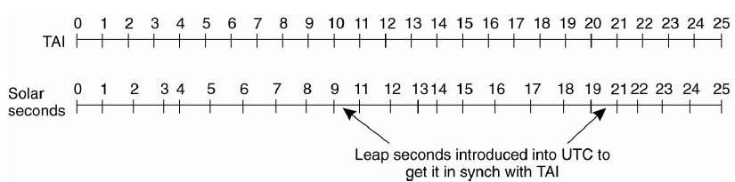
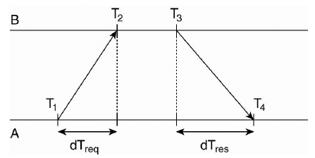
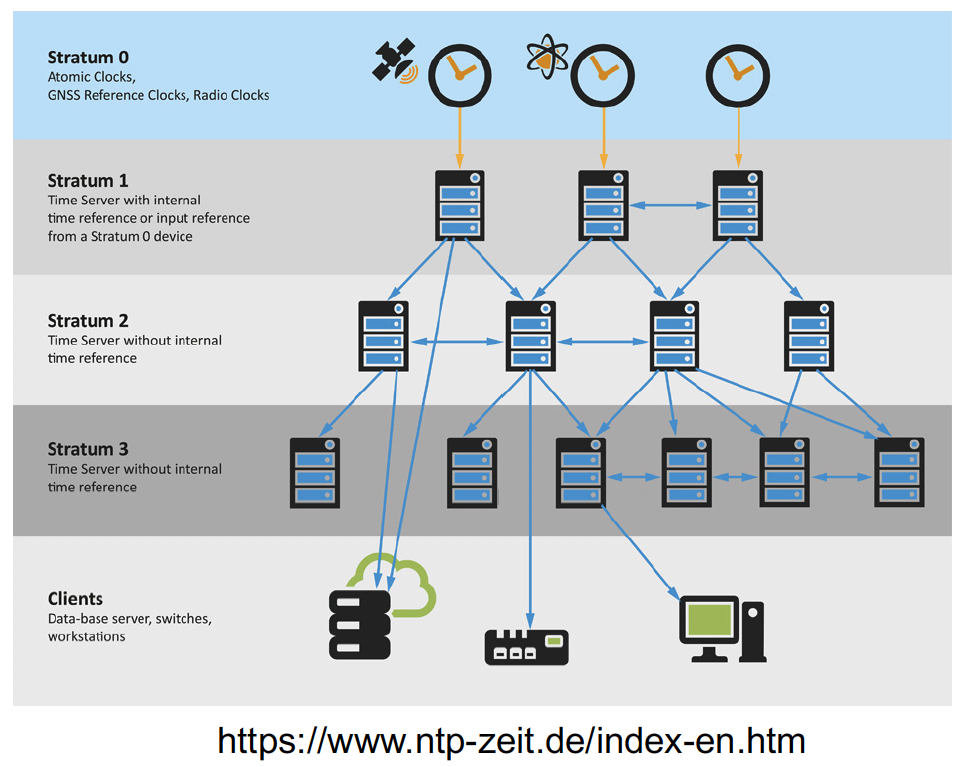
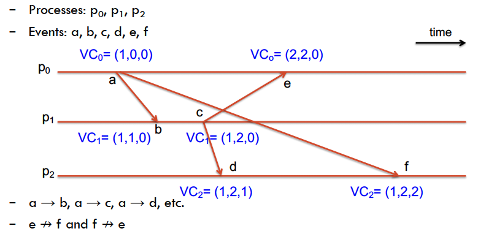
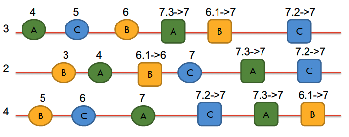
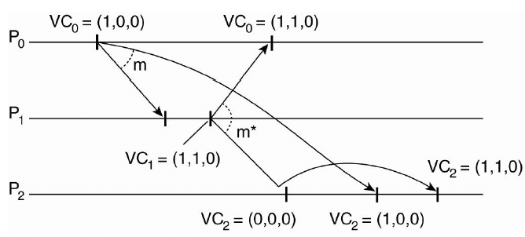
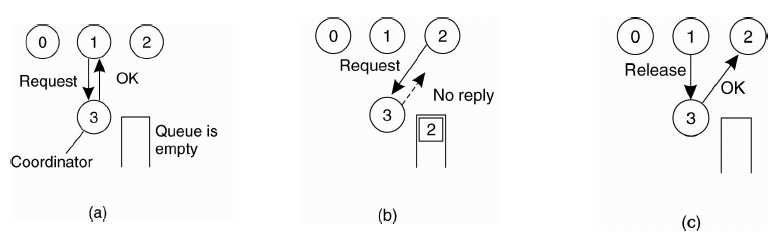

### __Concepts Overview__

**How is time measured?**

Time is measured astronomically... a day is defined as the interval between two consecutive events of the sun reaching its highest point in the sky.

__atomic seconds vs. solar seconds__

To this effect, a __solar second__ is used to denote the smallest unit that syncs with the movement of the sun. Every solar second can be different, e.g. in September the Sun takes less time between days to reach the peak. Hence the solar second is in complete.

So we introduce a __mean solar second__ averaged over many samples of solar seconds that revolves around an imaginary sun that is always consistent.

We define a second as "the number of times it takes a cesium 133 atom to make exactly 9,192,631,770 transitions."

The large number above was decided to be the atomic second that is equal to the mean solar second.

__Why leap seconds?__

The issue with this is that at the end of the day, the mean solar second and hence atomic second is always going to be different to the actual solar second.

So we need to keep in sync with the sun by introducing leap seconds.

__UTC__

That is, if the discrepancy between atomic and solar time grows to larger than 800msec, then BIH (bureau for measuring time) introduces a leap second. This corrected time system is called UTC.

---

**What are the most accurate time broadcasters we have available?**

- Atomic clocks
- GPS (29 satellites in orbit, developed for US military, each satellite has 4 atomic clocks).
Radio wave stations

---

**What is the difference between hardware and software clocks?**

Hardware clocks are what we mentioned, at each clock tick, one second is added to the time stored. 

Quartz crystals can be used - when under tension the crystals oscillate at the defined frequency.

Software clocks start running at boot time and synchronise to hardware clocks. 

They are used by the OS to indicate rough approximation of time. 

Note: multiple CPUs == multiple clocks! And they get progressively out of sync.

**What is the relation between clock time and UTC?**

When the clock time is corrected to be in sync with solar time, it is called UTC.

The UTC is the primary time standard which is used by use to regulate time and clocks around the work. It is within 1/sec of mean solar time at $0^{o}$ latitutde, not adjusting for daylight saving time.

---

### __Synchronisation Algorithms__

**Explain the network time protocol, i.e. Cristians' algorithm**

Assume that the clock rate increases monotonically, and both message transitions take roughly equal time, then we have

$$RTT := (T_{4}-T_{3}) + (T_{2}-T_{1})$$

with offset defined as

$$T_{4} - T_{3} - \frac{RTT}{2}$$

and the time is re-adjusted to 

$$T_{3} + \frac{RTT}{2}$$

The NTP algorithmis set up pair-wise between servers, like below.

The algorithm is run 8 times and the pair with the minimum $RTT$ is used as the most precise offset. 

We organise the clocks by a hierarchy to avoid more accurate clocks being de-synced by less accurate clocks. The server with an atomic clock operates at stratum zero.

A server at stratum $j$ is synchronised with a server at stratum $j+1$.

---

**Explain Berkley's algorithm.**

If we do not have a very accurate atomic clock to use, then can apply Berkeley algorithm for relative synchronisation.

Here we have a time daemon request times from all nodes. It computes the average value and sends it back to all the nodes to adjust to the same time.

---

**What are the pros and cons of physical time?**

Very powerful representation of time in all distrbuted events.

However, it is very hard to achieve at scale. You would require message transmission to have UB duration, and similar LB durations.

Hence, in a distributed system when the message communication time can be large, have large variance and unpredictably fail, synchronising with physical is difficult to achieve consistently.

Hence we turn to logical time.

--

### __Logical Time__

**Define logical time. Why is using logical time a reasonable choice?**

Logical time is a system-wide agreed-upon time that is not necessarily in sync or follows physical time.

Often, we just need to keep track of the order of events, as opposed to the absolute time when they occurred.

---

**Explain "a happens before b"**

In notation, this is $a \rightarrow b$.

This occurs if one of three conditions are satisfied

1) If "a" occurs before "b" on the same process.
2) "a" is event of a message sent by p1 to p2 and "b" is the event of receiving the message in p2.
3) "c" is an event such that "a"$\rightarrow$"c" and "c"$\rightarrow$"b"

In this case, if "x"$\rightarrow$"y" is not true then neither is "y"$\rightarrow$"x". In this case "x" is said to be concurrent to "y".

__All these letters represent events!__

---

**Explain Lamport's logical clocks and Lamport's logical clocks algorithm.**

The algorithm is as follows:

Every process $p_{a}$ maintains a local time counter $c_{a}$

- $p_{a}$ maintains local clock. When it executes an event $m$, $c_{a} += 1$.
- $p_{a}$ sends $m$ to $p_{b}$ sends $c_{a}$ as the time stamp.
- $p_{b}$ updates the clock for $c_{b} = \max\{c_{a}, c_{b}\}$
- $p_{b}$ updates its local clock again and executes the message/event received.

Here we have relative order between events that are related:

$$p_{a}\rightarrow p_{b} \Rightarrow c_{a} < c_{b}$$

---

**Explain vector clocks and the vector clock algorithm.**

The idea of vector clocks is to have a stronger relation of time between events.

Here we keep tab of all time counters for every process. Hence a vector of clocks.

The algorithm works as foollows:

Every process $p_{0}$ maintains a local time vector counter $vc_{0} = \{c_{0}, c_{1}, ... c_{n}\}$.

- $p_{j}$ maintains local clock. When it executes an event $m$, $vc_{j}[j] += 1$.
- $p_{j}$ sends $m$ to $p_{k}$ sends $vc_{0}$ as the time stamp.
- $p_{k}$ updates the clock for $vc_{k}[j] = \max\{vc_{j}[j], vc_{k}[j]\}$
- $p_{k}$ updates its local clock again $vc_{k}[k]+=1$ and executes the message/event received.

So here we have some guarantees that for two events $a$ and $b$ we have

$$vc_{j}(a) \leq vc_{k}(a) \iff vc_{j}(a)[i] \leq vc_{k}(a)[i] \;\;\; \forall i\in I$$

and hence we have

$$vc_{j}(a) \leq vc_{k}(a) \iff a \rightarrow b$$

---

**What is the difference between the two algorithms**

The key difference here is that logical clocks can only tell you if $a$ cannot happen after $b$.

Vector clocks can also conclude that $a$ happened before $b$.

### __Multicast__

**Define "ordering of messages".**

There are two types

a) __Totally ordered:__ for all messages $m_{i}$ and $m_{j}$, if $m_{i}$ is delivered at $p_{a}$ before $m_{j}$ then at $p_{b}$ the messages must be delivered in the same order i.e. $m_{i}$ before $m_{j}$.
b) __Causally ordered:__ for all messages $m_{i}$ and $m_{j}$, if $m_{i}$ occurs before $m_{j}$, then $m_{j}$ is NOT delivered before $m_{i}$ for any $p$.

---

**Define "reliability". What are the 3 features?**

a) __Integrity:__ messages don't just appear, it has to have a process that sent the message for this message to exist
b) __No duplicates:__ every message is received at most once at any single process
c) __Liveness:__ all messages broadcast by a processor are eventually received by all processors.

---

**Describe FIFO multicast.**

For FIFO multicast, each process $p_{i}$ has its own queue that stores incoming messages. The process has previously sent messages with time labels from $1$ to $T$. When a message is sent it is marked $T+1$. The next message sent after that will be $T+2$ etc.

For the receiving process $p_{k}$ , we put the message from $p_{i}$ into a queue and we only resolve that message when the messages with timestamps $1$ to $T$ from $p_{i}$ have been resolved. 

So here we are required to keep a vector of timestamps for each process.

If we receive a message from $p_{j}$ with timestamp lower than the counter we're holding for $p_{j}$, then we can drop the message since we know we've already sent it.

---

**Describe totally ordered multicast.**

The goal of totally ordered multicast is to ensure that all replicas receive messages in the same order.

Formally, if a correct processs $P$ delivers $m$ before $m'$ then any other process $P'$ that delivers $m'$ would have already delivered $m$.

We can implement this using Lampart's logical clocks. Each process maintains a logical clock and a priority queue of messages.

1) A processor $p_{i}$ increments its logical clock and FIFO-multicasts a message with current clock as timestamp.
2) Any incoming message is queued according to its temporary timestamp and acknowledged by FIFO-multicast message to every other process (including the sender).
3) Once all processes have acknowledged, the sender sets the definitive clock as the current clock it has for this message.
4) A message in the queue is delivered once there is a message, acknowledged by all, from each process with a larger timestamp in the queue.

It is important to note here that $p_{i}$ does $t_{i} = \max\big\{{t_{i}, ts(m)})\big\}$ and increments clock by one ONLY when it receives a message and not an ACK.

For the ACK, it still adjusts its clock but does not increment.

See the example below.

Here we have $B:6, A:7, C:7$. However, we deliver messages based on the order of both timestamp and process ID.

Hence we have $C: 7.2$, $A: 7.3$ and thus we deliver B, C, A in that order.

---

**Describe causal ordered multicast.**

Broadcasting messages are delivered only if causally preceding messages have already been delivered.

Formally, if $M(g, m)\rightarrow M(g, m')$ then any correct process that delivers $m'$ would have already delivered $m$.

All processes hold a vector clock and priority queue of messages. 

The processors $p_{i}$ increments $vc_{i}(i)$ ONLY when sending a message and not receiving.

In this case, we send through a vector clock.

We similarly take $vc_{i}[j] = \max\{vc_{i}[j], vc_{j}[j]\}$

Now, we can only deliver the $m$ from $p_{i}$ if

a) $ts(m)[i] = vc_{k}[i] + 1$ $\longleftarrow$ that is, $m$ is indeed the next message

b) $ts(m)[l] \leq vc_{k}[l]$ $\;\;\forall l\neq i$ $\longleftarrow$ that is, all other causally preceding messages have been delivered. 

---

### __Mutual Exclusion__

**Define mututal exclusion and explain why this is important.**

Concurrent access may corrupt the resource or make it inconsistent, especially for writes.

Hence we would like resources to have exclusive access when writing to it.

---

**Describe the centralised algorithm for mutual exclusion.**

The algorithm requires request, grant and release messages only.

Hence very straightforward to implement. No process will wait forever. 

However, the centralised node is a single point of failure.

---

**Describe the decentralised algorithm for mutual exclusion.**

In a distributed system, we assume that data is replicated several times. Let's say every resource is replicated $n$ times, with each replica having its own coordinator.

Accessing the resource requires a majority vote of coordinators.

A coordinator always responds immediate to a request.

This is great, but if a coordinator grants permission to another node and then fails, it won't remember the status of its grant. Hence we want to be able to deal with that.

---

**Describe the Ricart and Agrawala algorithm.**

Define:

- __site:__ node that runs the algorithm
- __requesting site:__ site that is requesting to enter critical section
- __receiving site:__ every other site that will be receiving a request from the requesting site.

The algorithm is as follows:

1) requesting site sends request to all other sites. This includes site name, current timestamp (logical clock) etc.
2) receiving sites receive request. It will reply with a timestamped message $\iff$ 
- the receiving process is not interested in the critical section that is being requested
- the receiving process has a lower priority (higher timestamp)
Otherwise the message reply is being deferred

3) The requesting site enters critical section only after receiving ALL reply messages.
4) Upon exiting the critical section, the site sends all deferred reply messages. 

The issue with this algorithm is that we now have $n$-point of failures... so if one node fails then we might end up starving the process forever.

A way to deal with this is to have the received always send a reply, either grant or deny. If the request/reply is lost the sender times out and keeps trying until a reply comes back or the sender concludes that the destination is dead.

After a request is denied, the sender should block and wait for an "ok" message.

Getting permission from ALL nodes is really expensive. We can modify it grant permission to one process if a majority of grants is issued.

---

**Describe the token ring algorithm.**

Here we have all the processes in a ring and we pass a token around and whichever process wants to enter the critical can enter when it holds the token.

Here we ensure that the same region can't enter the critical region and make a duplicate update by requiring that each process can only enter the critical region once with each unique token.

**Summarise the 4 algorithms**

| Algorithm | Messages/entry (or exit) | Delay before entry (messages) | Problems |
|:---:|:---:|:---:|:---:|
| centralised | 3 | 2 | coordinator crash |
| decentralised | 3mk | 2m | starvation, low efficiency |
| distributed | 2(n-1) | 2(n-1) | crash of any process |
| token ring | 1 - $\infty$ | 0 to n-1 | lost token, process crash |

---

### __Leader Election__

**Explain leader election and why its important.**

Some algorithms require one process to act as a coordinator. The challenge is how to choose this coordinator (or leader).

If a coordinator is fixed once chosen, then it will be a centralised solution.

For distributed systems, it is best to have a coordinator changing all the time to avoid single point of failure.

---

**Explain the bully algorithm.**

A process $p$ sends an "election" message to all processes with higher numbers.
If no-one responds, then $p$ wins and becomes the leader.

Else, if any of the higher-ups answer then it takes over and $p$'s job is done.

If more than one responds, then another election is held until the highest number process is determined. 

At this point, the coordinator is determined and the node sends "coordinator" message ot all running processes. That way, the failure of a node is handled and every proceeds as usual with a new coordinator.

---

**Explain "election in a ring" algorithm.**

Process priority is organised into a logical ring.

Then process with highest priority is elected as coordinator.

Any process can start an election by sending messages to its successor. If a successor is down then the message is sent to the next successor.

If a message is passed on, the sender adds itself to the list. When it gets back everyone who has responded is then present and we know who is available.

Then the initiator sends a coordinator message around the ring and the one with the highest priority is elected as the cordinator.

If two nodes start elections simultaneously, both messages will be sent around, and the end result is that we have used some extra computations but since both processes have identified the same nodes then the coordinator chosen will be the same.

---