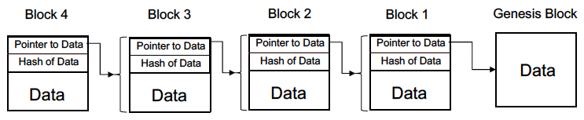
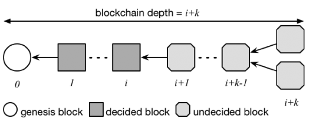
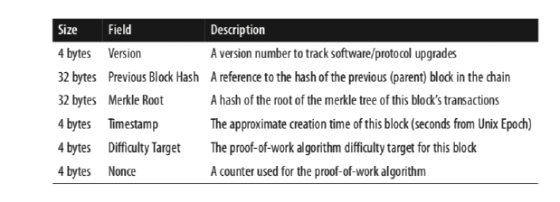
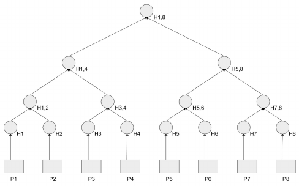

### __Concepts Overview__

**Describe the architecture of a blockchain. What kind of graph is it?**

The blockchain is a DAG. Its structure resembles typical linked list where pointers point its parent block (in terms of time inserted).

The pointer is the representation of a hash of the destination block that the source block contains.

The first block in the chain is called a __genesis block__.

---

**What are the 4 types of roles in a blockchain?**

__Network routing nodes__

Looks after validation and propagating of transaction and blocks

__Full node__

Maintains a full and up-to-date copy of the blockchain.

__Wallet__

Usually a desktop blockchain client. Typically maintains a subset of the chain. The wallet node will verify transactions using "simplified payment" verification".

__Miner__

Miner nodes compete to create new blocks. Some are full nodes whilst others are lightweight nodes participating in pool mining.

---

**Explain what a miner is and what they do. How do they obtain the rewards for mining?**

A miner is someone who engages in solving the cryptocurrency puzzle for the blockchain in order to receive a reward and add transactions to the blockchain.

With each new transaction, new coins are created and small portion of those coins are given to the miner/s that successfully solve the puzzle as a reward for expending the computing power to do so.

The reward includes a portion of those new coins and transaction fees from all of the transactions, which scales with the value of the transaction.

Mining is the activity.

---

**How do the rewards that miners earn change over time?**

Mining rewards are cut every 210,000 blocks (or $\sim$ 4 years). When all the bitcoins have been issued (year 2140, or 21million) then there will be no more rewards or bitcoins issued again.

Then the only reward will be transaction fees.

The primary purpose of mining is not the reward however, but instead the transaction fee.

---

**Why do rewards halve or reduce over time?**

Finite and diminishing issuance created a fixed monetary supply that resists inflation, although bitcoin is deflationary in nature.

---

**When is a transaction committed?**

Every bitcoin node, including miners, will verify all its transactions against a (long) checklist before forwarding the transactions to its neighbours.

After they are validated, the transactions are added to a __memory pool__ where they will wait until they can be mined into a block.

For a miner, receiving a new block means someone else has already mined it and they will need to find a new one to mine.

Transactions are selected from the memory pool with earlier and higher-value transactions being priorities.

The first 50kb of a block is always set aside for high-priority transactions. 

The first block contains the __coinbase transaction__, which holds all the rewards for the block.

The blockchain with a block at index $i$ will be decided when the chain reaches depth $i+k$ and a transaction will be committed if it belongs to that decided block.

For bitcoin, k=7. For ethereum, k=12.

---

**What does the block header look like?**

The block header is

---

**What is a Merkle tree? How is it used in blockchain?**

Every leaf node is the data block and every non-leaf node is a cryptographic hash of the labels of its child node.

This allows efficient and secure verification of contents of large data structures.

To check if a transaction exists, you at most need $2\log_{2}(N)$ calculations, where $N$ is the number of data block leaves.

To do this, you would take the hash of your data block that you want to check say $D$ and then hash it. Combine that with the hashed value of the other child and then compare it to the hashed value of the parent. Continue this until you reach the root and if all the hashes are equal then this transaction is correct. 

---

**Define "nonce". What is "proof of work" and how is it related to constructing blocks?**

A nonce is an arbitrary number that is used once in cryptographic communication. It is a pseudo-random arbitrary number that is issued in authentication protocol to ensure that old communications cannot be reused in replay attacks. 

Similarly, they can be used in proof-of-work systems.

In blockchain systems, there is a threshold defined as the number of zeros at the beginning of a 256bit hash.

The smaller the threshold (the more zeroes) the more difficult it is to find a nonce. That is, the more prefix zeroes that are required, the more difficult it is.

We would like to find a hash that is smaller i.e. has more zeros than the proposed difficulty target. In the case of concurrent blocks being mined, we take the block with more zeros (i.e. more difficult to compute).

For proof of work, it refers to the computing power invested in finding an appropriate nonce below the threshold.

Verifying the nonce is easy of course.

Once a nonce is found, it is verified and a block is immediately transmitted to all peers in the system. Each peer validates the block with a series of tests and then propagates it for committing to the network.

Miners typically do not act dishonestly because if someone discovered the lie than the block will be rejected and the mining reward lost.

---

**How often is Bitcoin difficulty adjusted? What about Ethereum?**

Bitcoin difficulty is adjusted every 2016 blocks ($\sim$ 2 weeks) to keep the 10min/block interval. The formula is

$$T_{i+1} = T_{i} \times (\text{actual time of last 2016 blocks}\;\times\; 20160\text{mins})$$.

So theoretically new difficulty can go up or down. The adjustment factor is constrained to be less than 4 to avoid extreme volatility.

Ethereum difficulty is adjusted near real-time, that is, block by block to keep 12-13 second intervals per block.

---

**What model does the blockchain employ for consensus and propagating a new block commit to its peer nodes?**

It employs a gossip-based protocol.

---

**What are the 3 types of chains the every node maintains?**

1) __main blockchain__
2) __secondary chains:__ the branches or forks from the main chain that have diverged.
3) __orphans:__ blocks that do not have a known parent.

**Explain how Bitcoin resolves forks in the Blockchain. How does Ethereum reach consensus?**

Blockchain reaches consensus using the chain of blocks with the most cumulative difficulty. This is the chain with the most blocks, and if there are two equal length chains we take the one with more proof-of-work, i.e. less zeroes.

Ethereum is inspired by GHOST (greediest heaviest observerable sub-tree) algorithm but is different. It looks at the branch with highest total difficulty, the sum between its last block and its ancestors.

__GHOST__

We take the heaviest subtree (with hardest combined proof-of-work), looking at all the branches in a subtree as opposed to a single chain.

---

**What is the impact of mining power on Blockchain security?**

Faster mining and if you have a majority, you could potentially dominant the P2P network and construct your own chain with any transaction since you'd be mining faster than everyone else.

**What is the impact of network delay on Blockchain security?**

If the network delay is too much, then multiple forks will be formed... so you'll have a chain with 5 forks instead of a single chain of length 5.

---