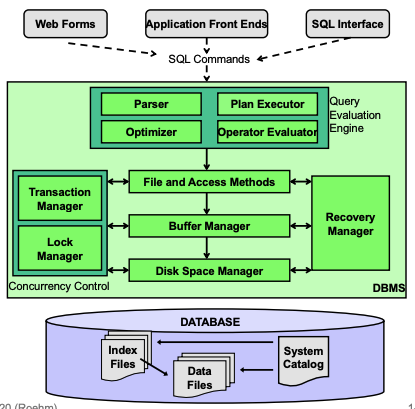

### __Concepts Overview__

**Briefly sketch the internal layer of a DBMS.**

---

**Explain the 4 key principles of database management systems**

1) __Data independence:__ applications are de-coupled from structure of data. Logical de-coupled from physical.
2) __Declarative interface:__ tells DBMS what we want not how to get it. Separates interface from implementation.
3) __Space can be reused but not time:__ Prioritising speed by using indexing and copies for lookups
4) __Scale-agnostic design:__ local processing that doesn't rely on a global state can be parallelised and cloned/restarted on new nodes.

---

**What are the 4 layers of "data science platforms"?**

$$\text{application} \rightarrow \text{data processing} \rightarrow \text{storage} \rightarrow \text{infrastructure}$$

---

**What are the 3 steps of query processing?**

1) Query parsing
2) Query optimising
3) Query execution

---

**What is the difference between "scaling-up" and "scaling-out"?**

Scaling-up: increasing power of a single computer.
Scaling-out: using a distributed system of multiple, independent computers.

---

**Define "logical data independence".**

Applications are protected from logical changes in data.

---

**Define "physical data independence".**

Applications are protected from physical changes in data.

---