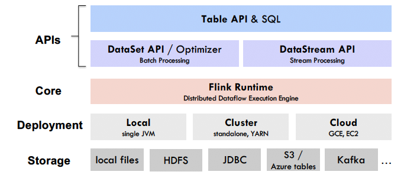
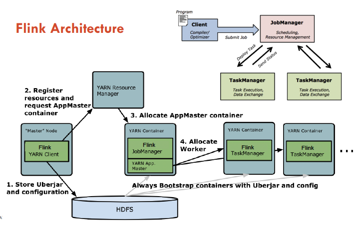
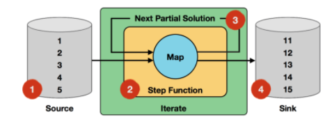
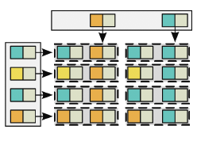
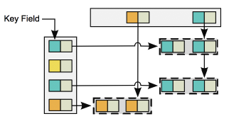
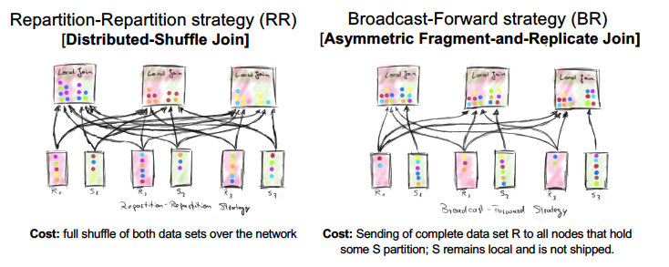
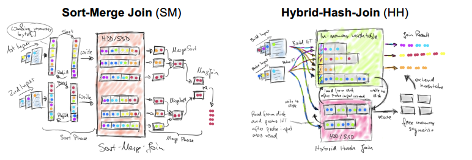
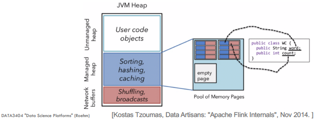
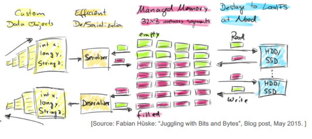

__Key questions__

- Describe Spark's RDD dataset.
- Describe some of the RDD API's operations.
- What type of join does Spark's RDD API use?

### __Apache Flink__

**Draw a diagram of Flink's stack.**

Note: The application master in Flink is different to Spark.

---

**Draw a diagram of Flink's architecture.**

---

**What is the unit of data in Apache Flink called and what is its structure?**

The unit of data is called a __tuple__. The tuple consists of an element at each position in the vector. The element can be a scalar of another nested data field.

The primitive data types include

- byte, short, integer, long
- float, double
- character, string
- boolean, null

---

**What is the difference between value types and the primitive types in Flink?**

In addition to the primitive types, we can also create UDDT (user-defined data types).

There are also "__Value__" types in Flink. It has pre-defined "Value" types that are mutable. Some of them are:

- ByteValue, ShortValue,
- ...
- BooleanValue etc.

Value types must declare their serialisation and de-serialisation manually.

This is useful if the normal methods are highly inefficient. For example, if you have spare vectors then you can use a special encoding for the non-zero elements. The general purpose serialisation would simply write all array elements.

---

**What is a collection of units of data in Apache Flink called?**

A collection of tuples is called a DataSet or DataStream.

---

**What is the programming model for Flink?**

The programming model for Flink is based on parallelisable operators. 

The basic building blocks are 

- __streams:__ a flow of data records.
- __transformations:__ is an operation that takes one or more streams as ionput and produces one or more output streams as a result.

Flink programs are mapped to streaming dataflows consisting of stream and transformation operators. 

Each dataflow starts with one or more sources and ends in one or more sinks.

__Parallelisation__

A stream may have one or more __stream partitions__, and each operator has one or more operator subtasks.

The subtasks are INDEPENDENT of each other and hence can execute in different threads or nodes. The number of operator subtasks is the parallelism of that particular operator.

Parallelism of a stream is always that of its producting operator. Streams can transport data between two operators using either

1) __one-to-one:__ the source and map operators preserve partitioning and order of elements
2) __re-distributing:__ stream partitions after one operator subtask are sent to different target operator subtasks, depending on the transformation. The order preserved is only amongst the pair of sending and receiving subtasks pair. 

Examples of re-distributing transport is `keyBy()`, `broadcast()` or `rebalance()`. Z

---

**What are some of the data transformations in Flink?**

- Map/flatmap
- Reduce
- Iterate
- Cross
- Cogroup
- Join

---

**Describe the map/flatmap operator.**

As you would expect, a 'record-at-a-time' operator.

In both cases, apply a function to each individual record.

map - returns one output
flatmap - returns zero to `n` output/s.

---

**Describe the reduce operator. Explain how you might optimise the reduce procedure.**

A 'group-at-a-time' operator with one input.

Groups the tuples of its input on a so-called record key, and hands each group into the user function.

Input length and output length are arbitrary (w.r.t. number of tuples).

Very commonly used for aggregations.

__Optimising__

The reduce operator supports an optional UDF'd `Combine` function.

This would be relevant if the reduce operator can be computed from partial results that were aggregated locally in different nodes. For example, summing the numbers is commutative so we can compute subgroups and sum across the subgroups.

Whether to use combine or not depends on Flink's optimiser.

---

**Describe the iterate operator.**

Here we see an array of integers [1, 2, 3, 4, 5] being passed into the operator and incremented 10 times before the final result is released.

The termination condition is either max number of iterations or aggregator convergence (custom) and convergence criteria is satisfied.

The flow is

$$\text{input} \rightarrow \text{step fn} \rightarrow \text{next partial sol.} \rightarrow \text{iter. result} \rightarrow \text{termination cond.} $$

---

**Describe the cross operator.**

'Record-at-a-time' operator with two inputs. Does not require any specification of record key.

As you would expect, it builds a Cartesian product of the records of both inputs and calls the UDF for each pair of records. 

The UDF accepts a pair of records from each stream and can emit any number of records.

---

**Describe the cogroup operator.**

A cogroup operator is similar to a group operator except it requires two relations (streams).

For streams, you need to specify a key and a common window. 

---

**Describe the join operator.**

'Record-at-a-time' operator with two inputs. Requires specification of record keys on both inputs. 

Operator function equi-joins both inputs on their record keys. 

The UDF accepts a pair of records from each stream and can emit any number of records.

Equi-join is the most common. It may be hard to implement a theta-join properly with streaming data.

---

**What are the inter-node joins in Flink?**

---

**What about the within-node (local) joins in Flink?**

---

**Describe the Flink optimiser.**

Some of the things the dedicated optimiser considers are:

- output sizes of each operator
- amount of data shipped over network 
- amount of data written top disk
  - if reliable size estimates cannot be made, then optimiser falls back to default values.

From the cardinalities it decides on 

- parallelism
- local (in-memory) pipelining strategy
- shipping (network) pipelining strategy

Note: There are 9 different ways to join two datasets:

- RR, BF broadcast S, BF broadcast R vs.
- SM, HH with R build-side, HH with S build-side

---

**Describe how Flink manages memory.**

Flink manages memory by using its own heap of internal memory pages (32kB memory segments). 

The reason for this is because keeping data as Java objects on the JVM heap would result in frequent garbage collection runs and potential OOM errors.

Flink represents the data internally as `raw byte[]`.

In its internal memory, it allocates 70% of free available JVM heap as `byte[]` segments and the internal operators use `allocate()` and `release()` on these segments.

This reduces pressure on the Java garbage collector and ensures that there will most likely be no OOM errors.

Flink also has its own serialisation stack that serialises all accepted data types to data segments. If more data needs to be processed than can be kept in memory, Flink spills to disk.

---

**What is a data sink?**

The data sink an the exit flow of a data flow. 

For Flink, data sinks provide a generic interface called `OutputFormat` to write their input data set to a variety of data stores or streams. 

The `OutputFormat` serialises records into a format and writes it to an interface outside of the system e.g. file system or database. 

`OutputFormat` are UDFs. Flink supports csv, row-delimited, binary, console (stdout).

For input into Flink, the ideas are similar. Flink provides a generic interface called `InputFormat` for UDFs. It can also support csv, binary (with constant record length), collection based or generic input from databases etc.

---

**Describe Flink's DataSet API and its features.**

---

**Describe Flink's Table API and its features.**

---