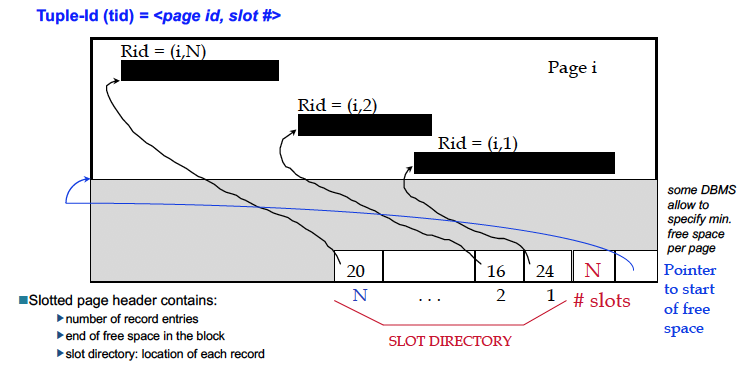

__Bonus__

- Why are multiple buffer pools useful?
- How does the DBMS know when to do pre-fetching?
- What is data sharing?
- Why does PostgreSQL use OS caching whereas other enterprise database software use their own implementation of caching?
- What is sequential flooding?
- Describe LRU-K.
- Describe Localisation.
- What are priority hints?
- What is background writing and why is it useful?

Note: CMU Databases L5

### __Concepts Overview__

**What are some characteristics of**
a) RAM: expensive and volatile storage of memory.
b) hard drives: cheap and stable, and offers large storage.
c) CPUs: takes instructions from a program and performs a calculation. 

---

**What implications does this have on DBMS design?**

Accessing disc is significantly slow than accessing RAM, for the CPU.

Furthermore, read/write operations from disk to RAM is high-cost so requires us to consider methods of optimising!

---

**Briefly describe the components of a hard drive. Drawing a picture might help.**


---

**What is the "access gap"?**

The "access gap" is the difference in read/write operations between disc and main memory data.


You can see an analogy of the problem using the diagram below.


---

**How do we try to overcome the "access gap" problem?**

We use a buffer to try and hide the access gap as much as possible. 

A frame in a buffer is equivalent to the storage of a page from disc (for simplicity sake).

Missing pages are fetched from disc and stored in buffer until the buffer is full. Then we use a "replacement" policy to decide which page stored in buffer to evict. 

Updates are written to the buffer directly and flushed to disc in order to be committed.

A stable copy is always stored on a hard drive.

**What are some examples of "raw data"? What kind of structure do they have? What are some issues with this type of storage?**

Examples of raw data include:

- csv
- text
- json
- xml

The issue with this type of data is that they are linear and maybe have nested sub-structures. 

This results in read/write operations being rather inconvenient. Often, we would be required to find a specific entry may require reading of the whole file. Updates and inserts will change the location of all the data. Appending is fine.

There is no indexing support with this.

---

### __Physical Storage of Records__

**What are some examples of database files?**

e.g. heap files, sorted files, indexes.

__Fixed length records__


This layout is clearly inflexible and doesn't accommodate for indexing. You can see the number of records inside the page and which pages are empty using a bitmap (page on RHS).

__Variable length records__


Consider the 3 options above:

1) delimited by special symbol: indexing? Search? Is it sorted?
2) field length: either to jump through, access is $O(n)$ where $n$ is number of records but you don't need to scan the whole thing, just jump to start of the page
3) array of field offsets: direct access to ith field and allows efficient storage of `null` values. Trade-off is a small directory overhead.

__Slotted Page structure for variable length records__



Here we see how a typical page is implemented in a variety of DBMS. We have an index of directories, free space allocated and a number indicating how many slots on the page.

We can move records on this page without changing `tid`, so its good for fixed-length records too. 

Notice the specific pointer (blue) that points to the start of the free space.

---

**Briefly describe the row format in PostgreSQL?**


RowHeader: Multiple bytes with flags and row visibility information
NullBitmap: 0 or ((|columns| + 7)/8) Bytes indicating which bits are null. Note that it is __1 for NULL__ and __0 otherwise__.
RowData: FixedColumns + VarColumns

FixedColumns: directly stored and aligned
VarColumns: varattrib + userdata + aligned.
  - varattrib = 4byte length words including 2 bits for compression/TOAST flags
  - TOAST := The Over-sized Attribute Storage Technique

---

**What are the pros and cons of different file organisations?**
a) heap: throw data in anywhere there is span. Good for file scan retrieving all records. However, if you need a particular value... then costly.
b) sorted: good for sequential order but maintaining sorted order is costly.
c) indexes: good for improving query performance. However, requires storage and maintenance overhead.

---

**What are the time complexity**
a) scan
b) read
c) query
d) write


---

**What is a "wide column" data store?**


A "wide column" store is when a DBMS stores data by column rather than row.

---

**What are some pros and cons of column storage?**

__Advantages__

Attributes not required by query doesn't need to be read and thus less I/O. This is very useful for OLAP-style aggregation queries.

Compression is better since the data type is theoretically the same. 

Parallel processing is even better, just load different parts into different processors and away you go.

__Disadvantages__

If you need to access all the rows then it will be expensive. Updates are also expensive.

---

### __Buffer Replacement Policies__

**Define a dirty page.**

A dirty page is a page on the buffer than has been modified.

Typically the buffer does not immediately flush the changes to disc. Updating the stable storage is usually deferred till later.

---

**Briefly describe the components of a buffer manager.**


```{pseudocode}
If requested page not in buffer:
  if buffer not full:
    chooses empty frame to put page in buffer
  else:
    choose frame for replacement based on policy
    - frame must not be in use ("pinned")
    - if the page evicted is dirty it is written back to disk
Buffer reads page from disc and puts it in allocated frame.

The buffer manager will pin the page (so it is not evicted immediately by a replacement policy).
The address of the page will be returned in main memory.
```

We can also use a pin count. The requestor of a page must unpin the page.

---

**Describe buffer utilisation. What is the formula and what is considered "good efficiency"?**

Aim for $>80\%$ read efficiency, defined as

$$\frac{\big\lvert\text{page requests}\big\rvert - \big\lvert\text{physical I/Os}\big\rvert}{\big\lvert\text{page requests}\big\rvert}$$

---

**Describe the 4 replacement policies. What one is most commonly used?**

- FIFO
- LRU
- MRU
- LFU


---

**What is clock? How does it work?**


A variant of LRU also known as "second chance".

When a new page is stored in buffer, we increment the __"referenced" bit__ to 1.

Any page with "referenced" bit greater than zero cannot be evicted.

When the buffer is full and we need to evict a page for a newly requested page, the clock hand scans around until it finds a page with "referenced" bit equal to zero. 

As it scans, every non-zero "referenced" bit it encounters, it decrements the "referenced" bit by one (so then the "referenced" bit is zero and next time the clock hand sees it, it will evict).

When a file is requested, the "referenced" bit is automatically incremented to one.

When the clock hand finds the file to replace, it evicts the page and at the end of everything it moves to the directly adjacent file and stays there until it need to evict the next buffer.

__GCLOCK__

Generalisation of CLOCK to have "referenced" bit go from 0 to $n$ instead of 0 to 1.

---

**What is pre-fetching?**

If a page can be predicted e.g. sequential scans, then pages can be pre-fetched several pages at a time. This will be faster instead of on-demand fetching where you'd have to wait for the buffer manager to run through and call disk to find the page etc.

It's also good for fetching large objects that span several pages.

---

**Why don't we just use the OS's buffer management?**

- difference in OS support (portability issues)
- limitations (files can't span disks but we can implement it how we want in our DBMS)
- buffer management requires capabilities: pinning, forcing page to disc, implementing CC and recovery etc. adjust replacement policy, pre-fetching pages etc.
- avoids double-buffering
- ultimately, it is because we have more control. 

---