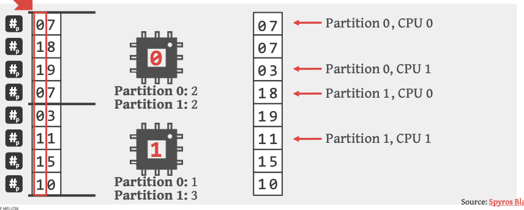

### __Concepts Overview__

**Describe the four main types of joins.**

a) __Theta join:__ $\theta$ $\rightarrow$ join two tables if some condition is true. 
b) __Equi-join:__ join two tables if specified attributes are equal in value. 
c) __Natural join:__ join two tables if ALL matching attributes are equal in value. This is a special case of equi-join.
d) __Outer join:__ joins two tables and includes all the rows from both tables. If either table does not have a matching value in the specified attribute, then the columns are returned as `NULL`.

---

**Which is the "outer relation" and which is the "inner relation"?**

$$\text{Student} \bowtie \text{Enrolled}$$

Student = OUTER
Enrolled = INNER

---

### __Dem Joins__

**Describe the following types of phyiscal join operations**

Include in your description their time complexity and potential ways to optimise query execution.

a) **Nested loop joins**

The simple nested loop join is the naive join.

Suppose we join two tables together as follows. 

$$R\bowtie_{\theta}S$$

The algorithm for simple nested-loop join is

```{pseudocode}
for each r in R:
  for each s in S:
    if f(r, s):
      add <r, s> to result
  end
end
```
where $f$ is the join condition.

Suppose there is only enough memory to hold one page of each table. Then the complexity is
$$
\lvert R \rvert \times b_{s} + b_{r}
$$
where $\lvert R \rvert$ is the number of records in $R$, $b_{s}$ is the number of pages for $S$ and $b_{r}$ is number of pages for $R$.

You can think of it as loading one page of each relation into memory, but you scan the entire $S$ for each $r\in R$. That is you loop through all the pages once for each $r$, giving you the first part of that complexity.

The second part is loading the pages of $R$.


<!--Pretty sure this is incorrect right?-->
<!--Let $B_{j}$ be the number of pages memory can hold at any time for table $j$. Then the complexity is-->

<!--$$-->
<!--\lvert R \rvert \times \frac{b_{s}}{B_{s}} + b_{r}-->
<!--$$-->

Note: The time complexity does not include output costs.

---

b) **Block nested loop joins**

Suppose we join two tables together as follows. 

$$R\bowtie_{\theta}S$$

The algorithm for simple nested-loop join is

```{pseudocode}
for each b_{r} of R:
  for each b_{s} of S:
    for each r in R:
      for each s in S:
        if f(r, s):
          add <r, s> to result
      end
    end
  end
end
```
where $f$ is the join condition.

$b_{s}$ is the number of pages for $S$ and $b_{r}$ is number of pages for $R$.

This time, instead of looping through every block of $S$ for a single $r$, we scan the block of $S$ each time and check with EVERY $r\in b_{r}$ before reading the next block.

Hence the new time complexity is reduced to

$$
\frac{b_{r}}{{B_{r}}} \times \frac{b_{s}}{B_{s}} + \frac{b_{r}}{{B_{r}}}
$$

Note: The time complexity does not include output costs.

Let $B_{j}$ be the number of pages memory can hold at any time for table $j$. Then the complexity is

$$\Bigg\lceil\frac{b_{r}}{B_{r}}\Bigg\rceil\times b_{s} + b_{r}$$

where $B_{r} = M - 2$ where $M$ is the maximum number of pages that can fit into memory. The $-2$ occurs because we reserve one for $b_{s}$ and one for writing the output.

Note: The time complexity does not include output costs.

---

c) **Indexed nested loop joins**

Index lookups can be used if 

i) an index is available for the join attribute 
ii) an equi-join (or natural join) is being conducted.

```{pseudocode}
for each r in R:
  lookup(r[attr], S)
  if f(r, s):
    add <r, s> to result 
end
```
where $f$ is the join condition and $b_{r}$ is number of pages for $R$.

Here, the cost is

$$b_{R} + \lvert R \rvert \times c$$

where $c$ is the cost of searching for the corresponding attribute in relation $S$.

Note: This does not work for outer joins.

---

d) **Sort-merge join**

We discussed the sort-merge join in the previous week.

Assuming that the input is sorted already, the cost is

$$b_{r} + b_{s}$$

if both relations have no duplicates. The sort-merge join is the best performing join if the inputs to the algorithm are already sorted.

This could be because there is an index or the DBMS has decided that the cost of sorting is low enough so it will sort it.

If there are duplicates (many-to-many join), the DBMS will build temp tables and loop through them in that table.

Once the duplicates have been processed, the algorithm moves on. This is a slight oversimplification but essentially thats the idea.

DBMS typically chooses a merge-join when the cost is low and usually an execution plan with a merge join is already quite good.

It is a good idea to check how the sorted data is coming into the algorithm. If the DBMS has added its own sort then maybe you can investigate.

The only thing that we should be worried about if there is alot of duplicates in the data when the execution plan has a merge-join.

---

e) **Hash joins**

Hash joins are important for OLAP (online analytics processing).

Define a hash function $h$ that maps an arbitrary input to a value that hopefully avoids collision.

Furthermore, assume that the common values in the specified attribute is a set

$$\big\{v_{1}, v_{2}, \dots, v_{l}\big\}$$

Denote 

$$\big\{R_{1}, R_{2}, \dots, R_{m}\big\}$$

and

$$\big\{S_{1}, S_{2}, \dots, S_{n}\big\}$$

to be the partitions of relations $R$ and $S$ respectively. As usual, assume $R$ to be the outer relation.

Assume that you have $W$ worker nodes (that you will use to parallelise the computation, then we scan through all partitions and run the hash function and place them in the worker node.

```{pseudocode}
1) BUILD 
for r in R:
  rHash = h(r[attr])
  calculate `j` = `mod(rHash, |W|)`
  add <r[attr], r> in `j`th worker node's hashmap HM`R`.
  
for s in S:
  sHash = h(s[attr])
  calculate `j` = `mod(sHash, |W|)`
  add <s[attr], s> in `j`th worker node's hashmap HM`S`.

2) PROBE
for s in S:
  if s[attr] == r[attr] in HM`R`:
    add <s, r> to output 
```


The cost is 

a) __partitioning phase:__ $2(b_{r} + b_{s})$
a) __matching phase:__ $b_{r} + b_{s}$
$\Rightarrow 3(b_{r} + b_{s})$ in total.

As an optimisation, you can hash the smaller relation (assumed to be $R$) and then probe directly instead of hashing both. That is, 

```{pseudocode}
1) BUILD 
for r in R:
  rHash = h(r[attr])
  calculate `j` = `mod(rHash, |W|)`
  add <r[attr], r> in `j`th worker node's hashmap HM.

2) PROBE
for s in S:
  sHash = h(s[attr])
  calculate `j` = `mod(sHash, |W|)`
  if s[attr] == r[attr] in HM:
    add <s, r> to output 
```

---

**Describe radix join. What kind of problems does it address compared to hash join?**

For hash joins, we aim to 

a) __Minimise synchronisation:__ avoid latches (locks for RAM memory structures)
b) __Minimise CPU cache misses:__ ensure data is local to each worker thread. Caching,  TLB capacity, locality will affect cache misses. You can use non-random access (scan/index traversal) where you execute more operations per cache line. Or use random access (like a hash join) and partition data to fit in cache + TLB.

Note: NSM = row-wise storage, DSM = columnar storage.

In Radix join, there are 3 stages:

1) __Partition__
2) __Build__
3) __Probe__

Whilst in hash join we discussed later 2 of the 3 steps, in practice there are a  options in the first step but it doesn't affect the main idea of hash join so much.

However, for radix join, the partition step is key.

The idea is to produce small hash partitions that fit the CPU cachesize to achieve cache locality. This will help minimise CPU cache misses and synchronisation

The algorithm is as follows:

Suppose we have the join

$$R\bowtie S$$

1) Scan R and compute a histgram for $DC[r[attr]]$, the number of tuples per hash key for the radix at some offset, where $DC$ is the count for each hash key.
2) Use the histogram to determine output offsets by computing the prefix sum
3) Scan R again and partition according to the hash key. Each worker thread has primaryu memory allocated based on histogram.
4) Continue to partition data until cache locality is achieved with different hash functions per pass. You would achieve this using different bits in the join key.

The partition using the radix looks like:



__Radix__ := value of an integer at a particular position (using its base)
__Prefix sum__ := running total of a sequence of numbers e.g. [1, 2, 3, 4, 5], then prefix sum is [1, 3, 6, 10, 15].
__Cache locality__ := the likelihood of successive operations being in the cache.

The recursion continues (step 4) until we get small enough partitions


Let $p$ is the number of passes. Then the expression for the number of passes is

$$p = \bigg\lceil\log\left(\frac{\lvert R \rvert}{s_{c}}\right)\bigg\rceil$$

This depends on the size of $R$ and size of cache $s_{c}$.

Note: From the lecture slides, the comparison looks like


---

**Name 3 other operations where join algorithms algorithms can be used to execution the operation. Describe how the join algorithms are used.**

- duplicate elimination $\longleftarrow$ hash sorting
- aggregation $\longleftarrow$ sorting/hashing brings the groups together
- set operations $\longleftarrow$ sorting

??? (unfinished)

---

**Discuss some general join conditions.**

a) __Equality__

e.g. $R\bowtie_{R.sid=S.sid \;\&\; R.rname = S.sname} S$

- for index nested-loop, build on SID if $S$ is inner or use existing indexes for SID.
- For sort-merge and hash-join, sort/partition on combination of the two join columns.

b) __Inequality__

e.g. $R\bowtie_{R.value < S.value} S$

- for index nested-loop, need cluistered B+ tree index! Range probing on inner relation will likely return higher matches than equality joins
- block nested-loop likely to be the best method here
- Hash, sort-merge not applicable

---