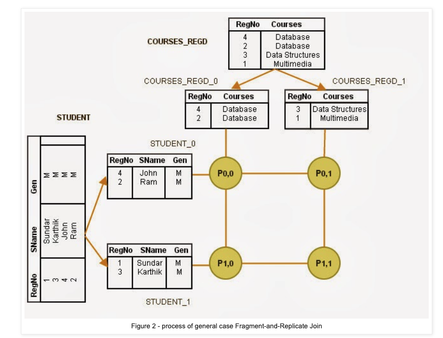
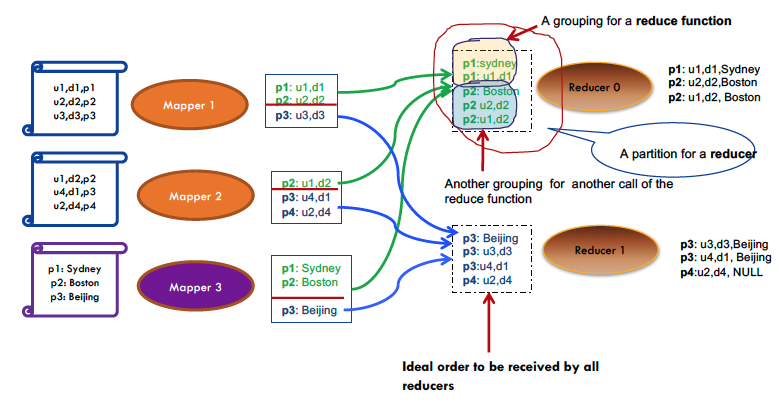

### __Overview__

**Briefly describe Wikipedia's architecture.**

Wikipedia has a primary-node asynchronous for data partitioning and replication across 2 data centres for each shard.

It serves PHP in the backend on Apache servers, distributed across multiple nodes. There are multiple nodes for storing web caches.

They have approximately ~300 application servers with ~140 MySQL servers distributed amongst 4 data centres. Hard configurations run from 64-192GB of ram with Linux OS and HDD as storage.

For data replication, the first shard holds the English wiki since it is the biggest. Then the second shard contains the next ~20 biggest wikis (languages?!) etc.

Each shard is replicated for availability and each shard has itrs own master. If the master fails then the shard for that Wiki becomes read only.

Each master controls between 2-14 slaves.

---

**What are the advantages and disadvantages of "scaling-out"?**

Scaling has a big advantage in that you can add cheap hardware and your scale is not hampered by the performance of the best hardware currently available.

The disadvantages include communication overhead between nodes, maintaining a highly parallel system amongst others.

There are also considerations for handling scalability and consistency and how to ensure maximum availability.

**What are the two goals of distributed data?**

a) Scale-agnostic data management

- sharding
- replication
- transparency

b) Scale-agnostic data processintg

- parallelisation
- availability
- elastic

### __Distributed Joins__

- Explain the following types of distributed joins
a) **Local (replicated) reference tables**

$$ R \bowtie S = R_{1} \bowtie S \;\cup\; R_{1} \bowtie S \;\cup\; ,\dots, \cup \;R_{n} \bowtie S $$

b) **Broadcast join**

$$ R \bowtie \sigma(S) = R_{1} \bowtie \sigma(S) \;\cup\; R_{1} \bowtie \sigma(S) \;\cup\; ,\dots, \cup \;R_{n} \bowtie \sigma(S) $$

This is assuming that the filer condition is very selective and as such as we have 

c) **Distributed-shuffle join**

$$ R \bowtie S = R_{1} \bowtie S_{1} \;\cup\; R_{1} \bowtie S_{2} \;\cup\; ,\dots, \cup \;R_{n} \bowtie S_{n} $$

For distributed-shuffle joins, the two tables are shuffled using a common method of partitioning e.g. hash or range. This ensures that identical attributes in both tables end up in the same machine.

Then, we can execute the joins independently in each node and merge them together. 

d) **Fragment-and-replicate join**

Two large tables $R$ and $S$ are partitioned into $n$ and $m$ parts respectively. 

Then, we have process $P_{i, j}$ compare the tuples of $S_{i}$ and $R_{j}$. The processor computes the join locally to produce the join result.

Broadcast join is a special case of fragment-and-replicate join, where $n$ or $m$ equals one.

We require $n\times m$ processes for this method to work.

Furthermore, any join and partitioning technique can be used.

Lastly, this can be used for non-equi-join conditions, whereas distributed shuffle joins can only be used for equi/natural-joins.

e) **Distributed-parallel hash join**

The distributed-parallel hash join is an example of a distributed-shuffle join.

Here we have a hash function $h_{1}(x)$ that partitions the two tables based on this hash function into $N$ nodes. 

For each $N_{1}$ nodes, we further partition the individual partition to maximise CPU usage. This is done using a different hash function $h_{2}(x)$.

The local joins are then executed e.g. hash join - build and probe.

---

### __MapReduce__

**Describe the key concepts behind MapReduce.**

"MapReduce" is a programming model and an implementation of the programming model that involves processing and generating big datasets on distributed systems.

MapReduce consists of two key ideas/procedures

a) Map: performs filtering/sorting on an existing dataset and transforms it into a new one.
b) Reduce: aggregates the dataset in such a way that returns a value of interest e.g. average or count.

The MapReduce framework is an implementation of the aforementioned ideas in such a way that the execution on a distributed system is fault-tolerance and scalable (in terms of performance).

---

**Describe the map operator and give an example.**

The map operator takes a function $f$ and applies to every element in the dataset. The result of the operation is returned as a new list.

---

**Describe the reduce operator and give an example.**

The reduce operator applies a function $f$ iteratively throughout every element in the dataset. The value returned at each step is used in the next computation is the one obtained from the output of the iteration.

---

- Illustrate using a diagram of how a map-reduce transformation is conducted "behind the scenes".
**What do MapReduce frameworks such as Hadoop provide in their APIs?**

Hadoop specifically provides functionalities for high performance execution of MapReduce in a distributed environment.

This includes

- initialising and parsing of files with replication and partition management.
- Resource manager e.g. scheduling jobs such as YARN
- Functions including shuffling, grouping and sorting of intermediate results.
- Communication between mappers and reducers.

with extra capabilities such as
- logging
- monitoring

---

**What are the two types of joins used on MapReduce?**

a) __broadcast (i.e. asymmetric fragment-and-replicate join)__
b) __partitioned join (distributed-shuffle join)__

---

**How are joins implemented in MapReduce?**

Joins are implemented in Hadoop with various features.

For example, multiple inputs have different formats will require differeent Mappers. Hence there needs to be a way to identify values coming from various input since the values are passed to the same reduce function.

Values are grouped based on a key - so you need a way to label and differentiate keys from different input data. Special handling is required to ensure that the labelled keys maintain their original partition position and the values from the key are grouped as a list to be sent to the same reduce function.

**How does secondary sorting work in Hadoop?**

Suppose you wanted to sort a dataset by two attributes instead of one? Well first, you would require a composite key, that is, a key that is defined by more than one attribute in the dataset.

So we have
$$(K_{1}, V_{1}) \overset{map}{\longrightarrow} (K_{2}, V_{2})$$

where $K_{1} = a$ and $K_{2} = (b_{j}, b'_{j})$. The values are scalars. Then we have
$$(K_{2}, List[V_{2}]) \overset{reduce}{\longrightarrow} (K_{3}, V_{3})$$

and $K_{3}$ and $V_{3}$ are both scalars. $K_{3}$ is likely one of the two keys $b_{1}$ or $b_{2}$ since we have aggregated some results.

So essentially, we have the __partitioner__ sending composite keys with identical values in the first element i.e. all the $(b_{1}, b'_{j})$'s and then the group comparator makes sure that the reducer receives 

$$(b_{1}, [b'_{1}, b'_{2}, \dots, b'_{n}]$$

for the reduction. The key of the grouped values in the intermediate step will be $b_{1}$ in this example. You can customise this by changing the implementation of the "key comparator".

In practice, you'd likely have to implement this yourself in Java.

---

**Which phase of the MapReduce job implements the functionality of the ORDER BY?**

It is implemented in the shuffle phase.

---